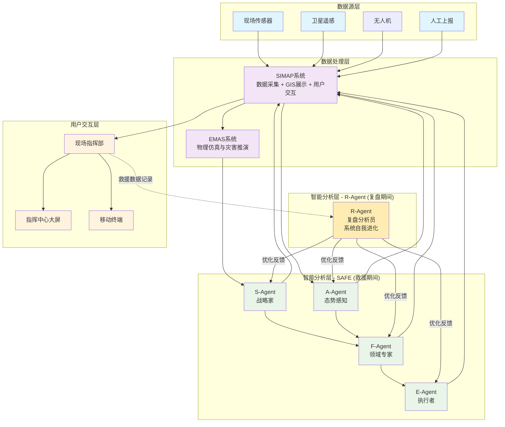

# SAFE多智能体应急辅助决策框架 - 项目简报

**版本**: 2.0 (最终版 - 完整商业分析)
**创建日期**: 2025-10-18
**更新日期**: 2025-10-19
**创建者**: Business Analyst (Mary)

---

## 📚 背景知识

### **S3DA2应急指挥框架**
S3DA2框架是现代应急指挥救援的理论基础，包含以下核心概念：

#### **四级用户模型**
1. **应急指挥中心层**: 制定战略、统筹资源协调（国家级和地方级）
2. **现场指挥部层**: 战术指挥、制定救援方案（突发事件现场核心）⭐️ **SAFE的核心目标用户**
3. **救援队伍层**: 执行救援方案、任务分配（各专业救援队伍）
4. **救援单兵层**: 具体任务执行、现场操作（基层救援人员）

#### **五步骤流程**
1. **感知**: 通过卫星、传感器、无人机等实时采集现场数据
2. **模拟**: 基于数据构建灾害演化模型，预测发展趋势
3. **谋划**: 制定多套救援方案，评估各方案效果
4. **决策**: 指挥官确定最优救援方案，形成行动指令
5. **行动**: 救援队伍执行具体任务，结果反馈形成闭环

#### **S3DA2框架含义**
- **S3**: Sense(感知) → Simulate(模拟) → Strategize(谋划)
- **DA2**: Decide(决策) + Act(行动) 在现场指挥部和指挥中心两个层级

### **现有技术基础**
#### **EMAS (Emergency Multi-Agent System)**
- 基于规则驱动的传统多智能体系统
- 负责物理仿真和灾害演化模拟
- 为SAFE提供仿真推演的基础数据

#### **SIMAP系统**
- 多元数据采集与GIS地图同步系统
- 接入现场多源数据并实现跨层级网络同步
- 作为整个系统的数据展示与交互核心

### **SAFE的定位**
SAFE是S3DA2框架中"谋划(Strategize)"环节的AI增强，同时支撑"决策(Decide)"环节，将传统的经验驱动升级为计算驱动。

### **系统架构关系图**



### **架构说明**

#### **数据流层次**
1. **数据源层** → **SIMAP** (数据采集和整合)
2. **SIMAP** → **EMAS** (提供仿真数据)
3. **EMAS + SIMAP** → **SAFE智能体** (分析决策)
4. **SAFE智能体** → **SIMAP** (结果展示)
5. **SIMAP** → **用户交互层** (用户操作界面)

#### **R-Agent独立运行机制**
- **触发条件**: 救援任务完全结束后
- **输入数据**: 整个救援过程的完整记录
- **优化目标**: SAFE四个Agent的决策能力
- **运行方式**: 独立于实时救援，不影响决策速度

---

## 📋 项目概览

**项目名称**: SAFE (Strategist-Awareness-Field-Experts-Executor) 多智能体应急辅助决策框架

**演进版本**: SAFER (SAFE + Reviewer) - 具备自我学习和进化能力的智能系统

**项目类型**: AI驱动的S3DA2框架智能分析引擎

**核心定位**: 为S3DA2应急指挥框架提供AI驱动的Strategize+Decide流程增强

**技术背景**: 基于现有MAS模拟器和SIMAP数据同步系统的深度集成

**创新特色**: 引入Reviewer角色实现系统自我进化，打造越来越安全的智能决策系统

---

## 🎯 产品愿景与使命

### 愿景
成为现场指挥部智能化战术决策的首选平台，通过多智能体协作实现信息的实时同步和方案的智能分析，让每一个指挥决策都有数据支撑。

### 使命
通过SAFE多智能体框架，为现场指挥部提供专业的战术决策支持，解决信息分散、资源调度困难、方案制定缺乏智能化分析的核心痛点，显著提升救援效率和决策质量。

---

## 💡 核心价值主张

### 1. AI原生且兼容传统
- **AI优先**: 充分利用最新AI技术解决传统难题
- **实用导向**: 不为用AI而用AI，以实际价值为准绳
- **向后兼容**: 有效整合非AI传统工具

### 2. 智能副驾驶角色
- **辅助而非替代**: 提前准备信息，分析可能性，最终决策由人类做出
- **主动智能**: 自动进行信息搜集、分析，无需人工触发
- **决策支持**: 提供全面的情报分析和决策建议

### 3. 开放平台架构
- **松耦合设计**: 不绑定特定技术路线
- **工具整合**: 有效组合现有工具和资源
- **扩展性强**: 支持领域知识和技术能力的持续升级

### 4. 跨领域适用性
- **核心场景**: 应急救援现场指挥部
- **扩展领域**: 安防指挥中心、边防指挥、重大活动安保等需要快速战术决策的场景
- **通用框架**: 可适配不同行业的特定需求和领域知识

### 5. 精准用户定位
- **核心目标用户**: 现场指挥部成员（为指挥长提供决策支撑的各部门专家）
- **用户痛点**: 信息同步困难、战术方案制定缺乏智能化分析、资源状态不清晰
- **交付模式**: 本地部署为主，SaaS服务为辅

---

## 🏗️ 产品架构

### 应急救援用户层级分析

基于实地调研，应急救援用户可分为四个层级：

#### **第一层：后方应急指挥中心层**
- **用户角色**: 应急管理部/厅/局指挥中心、最高首长
- **核心需求**: 资源协调、信息汇总、为领导提供决策支撑
- **技术接受度**: 中等，偏好稳定可靠的系统

#### **第二层：现场指挥部层** ⭐️ **核心目标用户**
- **用户角色**: 事发地政府领导、应急部门、专业救援力量指挥人员
- **核心需求**: 战术方案制定、现场指挥、多部门协调
- **痛点**: 信息同步困难、缺乏智能化分析工具、资源状态不清晰

#### **第三层：一线救援队伍层**
- **用户角色**: 救援队伍队长、班组负责人
- **核心需求**: 任务分解、团队协调、进度跟踪

#### **第四层：一线救援单兵层**
- **用户角色**: 具体操作人员、装备操作员
- **核心需求**: 操作指引、进度上报、实时通讯

### SAFE四重智能体框架 - 针对现场指挥部优化

#### **S - Strategist (战略家)**
- **职责**: 战术方案制定、方案评估、决策协调
- **现场应用**: 为指挥长提供多个可选战术方案，评估各方案的优劣势
- **能力**: 战术思维、快速方案生成、风险评估

#### **A - Awareness (态势感知)**
- **职责**: 现场信息收集、多源数据融合、实时态势分析
- **现场应用**: 整合各部门信息、监控救援进度、识别潜在风险
- **能力**: 实时监控、数据融合、威胁识别、进度跟踪

#### **F - Field-Experts (领域专家)**
- **职责**: 专业救援知识支持、最佳实践推荐、技术指导
- **现场应用**: 提供堤防决口、地震救援等专业知识，优化战术方案
- **能力**: 应急预案、行业知识、装备使用指导、经验教训总结

#### **E - Executor (执行者)**
- **职责**: 任务分解、执行跟踪、结果反馈、资源调度
- **现场应用**: 将战术方案分解为具体任务，跟踪执行进度，协调资源分配
- **能力**: 任务管理、流程执行、状态追踪、资源调度

### **R - Reviewer (复盘分析员)** - 系统自我进化核心

#### **职责与特色**
- **运行时机**: 仅在救援任务结束后启动，不影响实时救援决策
- **核心功能**: 对整个救援过程进行深度复盘分析和学习
- **进化机制**: 基于复盘结果持续优化系统各个组件

#### **具体能力**
1. **决策质量评估**: 分析SAFE给出的决策建议与实际结果的匹配度
2. **Prompt优化**: 基于实战效果优化各个Agent的提示词模板
3. **知识库更新**: 将成功的救援经验纳入知识库，失败案例作为改进依据
4. **流程优化**: 识别决策流程中的改进点，优化Agent协作机制
5. **安全机制**: 确保系统进化不会引入新的风险，保持决策的可靠性

#### **SAFER系统的进化闭环**
```
救援执行 → 记录数据 → Reviewer复盘分析 → 优化系统 → 下次救援更智能
```

#### **差异化优势**
- **自我学习能力**: 每次救援后系统都会变得更智能、更安全
- **持续改进**: 不需要人工干预就能实现系统的渐进式优化
- **知识沉淀**: 将救援经验转化为系统化的AI能力
- **安全增强**: 通过复盘识别潜在风险，让系统越来越安全

### 技术特色
- **Prompt工程为核心**: 将人类应急救援经验系统化，构建应急决策方法论
- **多模态交互**: 聊天界面 + 桌面虚拟化交互
- **主动工作流**: 基于条件判断和周期执行的自动化信息搜集和分析
- **激进创新模式**: AI工具试验田，验证效果后纳入正式版
- **现场适应性**: 支持网络不稳定环境下的离线操作能力

### 用户信任建立机制
1. **历史验证**: 用已发生事件验证系统准确性，与实际情况对比
2. **理论依据**: 提供坚实的计算模型、公式支撑，让决策有据可依
3. **渐进试用**: 通过试用期积累经验和口碑，逐步建立用户信任
4. **透明决策**: 系统给出的建议要有清晰的推理过程和依据

---

## 🎨 用户体验与交互模式

### 多种应用模式
1. **侧边栏模式**: 在现有指挥系统中作为辅助工具
2. **原生窗口模式**: 独立的聊天式交互界面，针对现场指挥部优化
3. **虚拟桌面模式**: 类似Computer-Use的桌面级交互（未来规划）

### 针对现场指挥部的交互设计
- **指挥中心大屏**: 实时态势展示、决策方案对比
- **平板操作**: 移动指挥、现场查看
- **语音交互**: 紧急情况下快速指令下达
- **多屏协同**: 指挥长与各部门专家信息共享

### 设计灵感
- **Manus**: 自然对话交互
- **Canvas**: 可视化信息展示
- **Computer-Use**: 虚拟桌面操作能力

---

## 🚀 发展路径与愿景

### 第一阶段：现场指挥部深耕期 (1-2年)
- **目标**: 专注现场指挥部，做深做透
- **核心功能**: 信息整合 + 战术建议 + 资源调度
- **交付方式**: 本地部署为主，建立信任和口碑
- **成功指标**: 在3-5个重大救援事件中成功应用

### 第二阶段：纵向扩展期 (2-3年)
- **向上扩展**: 支撑后方应急指挥中心
- **向下扩展**: 服务一线救援队伍
- **技术升级**: 引入更先进的AI能力和硬件集成
- **市场验证**: 在10+个省市部门建立标杆案例

### 第三阶段：横向扩展期 (3-5年)
- **领域扩展**: 安防指挥、边防指挥、重大活动安保
- **平台化**: 建立开放生态，支持第三方插件
- **国际化**: 探索海外市场机会
- **技术引领**: 成为行业技术标准和最佳实践

### 长期愿景
- 成为现场智能指挥决策领域的标准平台
- 推动整个应急管理体系的技术升级
- 建立AI+应急救援的最佳实践和知识库

---

## 🎯 核心竞争优势

1. **精准定位优势**: 专注现场指挥部，直击最痛痛点
2. **方法论优势**: 应急决策方法论的系统性应用，将人类经验AI化
3. **架构优势**: 多智能体协作，比单一AI更符合实际指挥场景
4. **实地验证优势**: 基于真实的救援现场调研，产品设计接地气
5. **灵活部署优势**: 本地部署+SaaS双轨制，适应政府采购需求
6. **信任建立优势**: 系统化的用户信任建立机制，降低采用门槛
7. **自我进化优势**: Reviewer机制让系统越用越智能，持续优化决策质量
8. **知识沉淀优势**: 将救援经验转化为系统化AI能力，避免人员流动带来的知识流失

### 商业模式特色
- **混合交付**: "云优先，本地可选"的灵活策略
- **价值导向**: 按救援效果和价值收费，而非按功能收费
- **生态合作**: 与现有应急系统厂商合作，而非替代

---

## 📊 项目状态

**当前阶段**: 用户调研完成，产品定位明确，准备进入技术可行性分析阶段
**用户调研成果**: 完成现场指挥部深度调研，明确四级用户分层和核心痛点
**下一步**: 技术架构可行性分析 + 商业模式细化
**关键决策点**: MVP功能范围、技术选型、首批试点用户选择

---

## 📝 深度分析结果总结

### ✅ 市场洞察
- **目标用户精准定位**: 现场指挥部成员是最核心的目标用户
- **用户需求明确**: 信息同步、战术方案智能化分析、资源调度优化
- **信任建立路径清晰**: 历史验证、理论依据、渐进试用三管齐下
- **标杆客户明确**: 中国安能集团作为首个客户（已有一期项目基础）

### ✅ 产品洞察
- **核心价值主张**: 为S3DA2框架提供AI驱动的Strategize+Decide流程增强
- **差异化定位**: 专注智能分析，不重复建设数据采集和仿真系统
- **交付模式**: 本地部署为主，SaaS为辅的混合模式
- **MVP功能明确**: 数据汇总报告、方案生成与依据、地图模拟展示

### ✅ 技术架构洞察
- **分工明确**: SAFE专注AI分析，EMAS负责物理仿真，SIMAP负责数据展示交互
- **集成策略**: 通过API与现有系统深度集成，避免重复建设
- **技术可行性高**: 基于成熟的S3DA2框架和现有技术栈

### ✅ 商业模式洞察
- **三阶段演进**: 项目制→混合模式→SaaS模式
- **价格锚点**: 200-500万项目制，未来转向订阅制
- **政策红利**: 契合中国政府AI+推广战略
- **区域策略**: SaaS从深圳、广州等创新城市开始试点

### ✅ 竞争分析
- **主要竞争**: 公司现有应急平台（百万级到千万级）
- **差异化优势**: AI驱动的智能化分析，而非简单功能堆砌
- **价值量化**: 通过历史案例对比证明救援效率提升

---

## 🎯 MVP产品规划

### **核心功能 (第一版本)**
1. **数据汇总与报告生成**: 整合SIMAP多源数据，生成智能分析报告
2. **方案生成与依据报告**: 基于SAFE四重智能体协作，提供多方案选择
3. **地图模拟结果动态展示**: 与MAS仿真器集成，在SIMAP地图上展示推演结果

### **进阶功能 (第二版本)**
4. **Reviewer复盘分析系统**: 救援结束后自动启动，进行深度复盘学习
5. **系统自我优化**: 基于复盘结果自动优化Prompt模板和决策逻辑
6. **知识库进化**: 持续更新救援知识库，沉淀实战经验

### **目标客户**
- **首要客户**: 中国安能集团（基于现有项目关系）
- **扩展客户**: 各省市应急管理部门、专业救援队伍

### **交付时间**
- **开发周期**: 6-8个月MVP开发
- **试点部署**: 安能集团二期项目集成
- **市场推广**: 试点成功后全面推广

---

## 💰 商业模式实施路径

### **第一阶段：项目制 (1-3年)**
- **收入来源**: 软件授权费 + 项目实施费 + 技术服务费
- **定价策略**:
  - 基础版: 200-300万（核心决策支持）
  - 完整版: 400-500万（全功能）
  - 定制版: 500万+（特殊需求）
- **目标客户**: 政府应急部门、大型央企

### **第二阶段：混合模式 (3-5年)**
- **收入转型**: 项目制 + 基础授权费 + 按场景收费
- **试点区域**: 深圳、广州等创新城市
- **免费策略**: 基础功能免费，高级功能付费

### **第三阶段：SaaS模式 (5年后)**
- **收入模式**: 订阅制为主，增值服务为辅
- **目标**: 成为行业标准平台

---

## 🚀 成功指标与价值量化

### **量化价值评估方法**
1. **时间节省价值**: 决策时间缩短 × 人力成本
2. **资源优化价值**: 救援投入减少 × 资源成本
3. **损失减少价值**: 人员伤亡减少 × 生命价值 + 财产损失减少
4. **效率提升价值**: 救援成功率提升 × 避免次生灾害成本

### **关键成功指标**
- **技术指标**: 决策方案生成时间 < 5分钟，方案准确率 > 90%
- **业务指标**: 客户满意度 > 85%，续约率 > 80%
- **财务指标**: 3年内实现盈亏平衡，5年内ROI > 200%

---

## 🎯 下一步行动计划

### **立即行动 (1个月内)**
1. **价值量化研究**: 选择洞庭湖决口等历史案例进行详细分析
2. **MVP功能细化**: 制定详细的功能规格说明书
3. **安能集团沟通**: 确认二期项目集成需求和预算
4. **Reviewer系统设计**: 详细设计复盘分析系统的技术架构

### **短期计划 (3个月内)**
1. **技术架构设计**: 与架构师详细研讨技术实现方案
2. **原型开发**: 构建MVP原型进行验证
3. **政策资源对接**: 了解相关政府补贴和支持政策
4. **Reviewer原型开发**: 构建复盘分析系统的原型验证

### **中期计划 (6个月内)**
1. **MVP开发完成**: 开始安能集团试点部署
2. **价值验证**: 通过试点项目量化SAFE价值
3. **市场推广**: 准备推广材料和销售策略
4. **SAFER系统开发**: 集成Reviewer功能，实现系统自我进化能力

### **长期计划 (12个月内)**
1. **SAFER系统上线**: 在试点项目中部署完整的自我进化系统
2. **知识库积累**: 通过多次救援实践建立丰富的救援知识库
3. **智能化升级**: 基于实战数据持续优化AI决策能力
4. **行业标准制定**: 推动SAFER成为应急救援AI系统的行业标准

---

*本简报已更新至2.0最终版本，融入了完整的5维度深度分析结果和SAFER系统创新设计，为SAFE项目的商业化实施提供了全面的指导。*