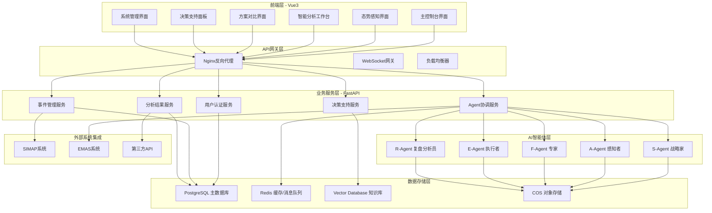

# SAFE多智能体应急决策框架 - Vue3全栈架构技术解决方案

**版本**: v1.0
**创建日期**: 2025-10-20
**架构设计师**: AI Assistant
**技术栈**: Vue3 + FastAPI + PostgreSQL + Tencent Cloud

---

## 1. 项目概述

### 1.1 系统简介

SAFE (Strategist-Awareness-Field-Experts-Executor) 多智能体应急决策框架是基于S3DA2应急指挥理论的AI驱动决策支持系统。本架构文档采用Vue3作为前端技术栈，为现场指挥部提供智能化的战术决策支持，将传统的经验驱动决策升级为计算驱动决策。

### 1.2 核心设计理念

- **AI原生且兼容传统**: 充分利用最新AI技术，同时保持向后兼容性
- **智能副驾驶角色**: AI负责信息搜集分析，人类保持最终决策权
- **开放平台架构**: 松耦合设计，支持扩展和集成
- **精准用户定位**: 专注现场指挥部战术决策需求

### 1.3 技术架构目标

- **高性能**: 30秒内完成Agent分析和方案生成
- **高可用**: 99.9%系统可用性，故障自动恢复
- **实时性**: WebSocket实时数据同步，3秒内界面响应
- **扩展性**: 支持Agent数量水平扩展和功能模块插件化

---

## 2. 系统架构概览

### 2.1 整体架构图



### 2.2 技术栈选择

#### 前端技术栈 (Vue3生态)
- **Vue 3.4+**: 采用Composition API，提供更好的TypeScript支持和性能优化
- **TypeScript 5.0+**: 类型安全的JavaScript，提升代码质量和开发效率
- **Pinia 2.0+**: Vue3官方推荐的状态管理库，替代Vuex
- **Vue Router 4.0+**: Vue3官方路由管理器
- **Element Plus 2.4+**: 企业级Vue3组件库，丰富的UI组件
- **ECharts 5.4+**: 数据可视化图表库，支持Vue3集成
- **VueUse**: Vue组合式工具集，提供丰富的实用hooks

#### 后端技术栈 (保持不变)
- **Python 3.9+**: 主要开发语言
- **FastAPI 0.104+**: 高性能异步API框架
- **SQLAlchemy 2.0+**: ORM框架
- **PostgreSQL 15+**: 主数据库
- **Redis 7.0+**: 缓存和消息队列
- **AutoGen**: 多智能体协作框架

#### 部署和运维
- **Tencent Cloud**: 主要云服务提供商
- **Docker**: 容器化部署
- **Nginx**: 反向代理和静态文件服务
- **WebSocket**: 实时数据通信

---

## 3. 前端架构设计 (Vue3)

### 3.1 项目结构

```
frontend/
├── public/                 # 静态资源
│   ├── favicon.ico
│   └── index.html
├── src/
│   ├── api/               # API接口层
│   │   ├── agents.ts      # Agent相关API
│   │   ├── events.ts      # 事件管理API
│   │   ├── dashboard.ts   # 仪表板API
│   │   └── websocket.ts   # WebSocket连接
│   ├── components/        # 组件库
│   │   ├── common/        # 通用组件
│   │   │   ├── BaseCard.vue
│   │   │   ├── BaseModal.vue
│   │   │   └── LoadingSpinner.vue
│   │   ├── charts/        # 图表组件
│   │   │   ├── LineChart.vue
│   │   │   ├── BarChart.vue
│   │   │   └── RealTimeChart.vue
│   │   ├── maps/          # 地图组件
│   │   │   ├── GISMap.vue
│   │   │   └── HeatMap.vue
│   │   └── agents/        # Agent相关组件
│   │       ├── AgentCard.vue
│   │       ├── AgentStatus.vue
│   │       └── AnalysisResult.vue
│   ├── composables/       # 组合式函数 (Vue3特性)
│   │   ├── useWebSocket.ts
│   │   ├── useAgentStatus.ts
│   │   ├── useRealTimeData.ts
│   │   └── useAuth.ts
│   ├── layouts/           # 布局组件
│   │   ├── MainLayout.vue
│   │   ├── DashboardLayout.vue
│   │   └── ManagementLayout.vue
│   ├── pages/             # 页面组件
│   │   ├── Dashboard.vue
│   │   ├── SituationalAwareness.vue
│   │   ├── IntelligentAnalysis.vue
│   │   ├── PlanComparison.vue
│   │   ├── DecisionSupport.vue
│   │   └── SystemManagement.vue
│   ├── router/            # 路由配置
│   │   └── index.ts
│   ├── stores/            # Pinia状态管理
│   │   ├── auth.ts        # 认证状态
│   │   ├── agents.ts      # Agent状态
│   │   ├── events.ts      # 事件状态
│   │   ├── dashboard.ts   # 仪表板状态
│   │   └── websocket.ts   # WebSocket状态
│   ├── types/             # TypeScript类型定义
│   │   ├── agent.ts
│   │   ├── event.ts
│   │   └── api.ts
│   ├── utils/             # 工具函数
│   │   ├── format.ts
│   │   ├── validation.ts
│   │   └── constants.ts
│   ├── styles/            # 样式文件
│   │   ├── main.scss
│   │   ├── variables.scss
│   │   └── components.scss
│   ├── App.vue            # 根组件
│   └── main.ts            # 入口文件
├── package.json
├── vite.config.ts         # Vite构建配置
├── tsconfig.json          # TypeScript配置
└── README.md
```

### 3.2 Vue3核心特性应用

#### 3.2.1 Composition API组件设计

```typescript
// src/composables/useAgentStatus.ts
import { ref, computed, onMounted, onUnmounted } from 'vue'
import { useWebSocket } from './useWebSocket'
import type { Agent, AgentStatus } from '@/types/agent'

export function useAgentStatus() {
  const agents = ref<Agent[]>([])
  const { subscribe, unsubscribe } = useWebSocket()

  const runningAgents = computed(() =>
    agents.value.filter(agent => agent.status === 'running')
  )

  const systemHealth = computed(() => {
    const totalAgents = agents.value.length
    const runningCount = runningAgents.value.length
    return {
      status: runningCount === totalAgents ? 'healthy' :
              runningCount > 0 ? 'warning' : 'error',
      percentage: totalAgents > 0 ? (runningCount / totalAgents) * 100 : 0
    }
  })

  const updateAgentStatus = (agentData: Agent) => {
    const index = agents.value.findIndex(a => a.id === agentData.id)
    if (index !== -1) {
      agents.value[index] = agentData
    } else {
      agents.value.push(agentData)
    }
  }

  onMounted(() => {
    subscribe('agent_status', updateAgentStatus)
  })

  onUnmounted(() => {
    unsubscribe('agent_status', updateAgentStatus)
  })

  return {
    agents,
    runningAgents,
    systemHealth,
    updateAgentStatus
  }
}
```

#### 3.2.2 Pinia状态管理

```typescript
// src/stores/agents.ts
import { defineStore } from 'pinia'
import type { Agent, AnalysisResult } from '@/types/agent'
import { agentApi } from '@/api/agents'

interface AgentState {
  agents: Agent[]
  currentAnalysis: Record<string, AnalysisResult>
  loading: boolean
  error: string | null
}

export const useAgentStore = defineStore('agents', {
  state: (): AgentState => ({
    agents: [],
    currentAnalysis: {},
    loading: false,
    error: null
  }),

  getters: {
    getAgentById: (state) => (id: string) =>
      state.agents.find(agent => agent.id === id),

    getRunningAgents: (state) =>
      state.agents.filter(agent => agent.status === 'running'),

    getAgentAnalysis: (state) => (agentType: string) =>
      state.currentAnalysis[agentType]
  },

  actions: {
    async fetchAgents() {
      this.loading = true
      this.error = null

      try {
        const agents = await agentApi.getAgents()
        this.agents = agents
      } catch (error) {
        this.error = error instanceof Error ? error.message : '获取Agent状态失败'
        console.error('Failed to fetch agents:', error)
      } finally {
        this.loading = false
      }
    },

    async triggerAnalysis(eventId: string) {
      this.loading = true

      try {
        const results = await agentApi.triggerAnalysis(eventId)
        this.currentAnalysis = results
      } catch (error) {
        this.error = error instanceof Error ? error.message : '触发分析失败'
        throw error
      } finally {
        this.loading = false
      }
    },

    updateAgentStatus(agentData: Agent) {
      const index = this.agents.findIndex(a => a.id === agentData.id)
      if (index !== -1) {
        this.agents[index] = agentData
      } else {
        this.agents.push(agentData)
      }
    },

    updateAnalysisResult(agentType: string, result: AnalysisResult) {
      this.currentAnalysis[agentType] = result
    }
  }
})
```

#### 3.2.3 响应式数据管理

```typescript
// src/composables/useRealTimeData.ts
import { ref, reactive, watchEffect } from 'vue'
import { useWebSocket } from './useWebSocket'
import type { RealTimeMetrics } from '@/types/dashboard'

export function useRealTimeData(eventId: string) {
  const metrics = reactive<RealTimeMetrics>({
    waterLevel: { current: 0, trend: 'stable', warning: 16 },
    flowRate: { current: 0, peak: 0, unit: 'm³/s' },
    rescueProgress: { completed: 0, total: 0, percentage: 0 },
    personnelSafety: { safe: 0, atRisk: 0, missing: 0 }
  })

  const lastUpdate = ref<Date>(new Date())
  const { subscribe } = useWebSocket()

  const handleMetricsUpdate = (data: Partial<RealTimeMetrics>) => {
    Object.assign(metrics, data)
    lastUpdate.value = new Date()
  }

  watchEffect(() => {
    if (eventId) {
      subscribe(`metrics_${eventId}`, handleMetricsUpdate)
    }
  })

  return {
    metrics,
    lastUpdate
  }
}
```

### 3.3 核心组件设计

#### 3.3.1 主控制台组件

```vue
<!-- src/pages/Dashboard.vue -->
<template>
  <MainLayout>
    <template #header>
      <DashboardHeader
        :current-event="currentEvent"
        :system-health="systemHealth"
      />
    </template>

    <div class="dashboard-content">
      <!-- 核心指标监控面板 -->
      <el-row :gutter="16" class="metrics-section">
        <el-col :xs="24" :sm="12" :lg="6" v-for="metric in metricCards" :key="metric.key">
          <MetricCard
            :title="metric.title"
            :value="metric.value"
            :unit="metric.unit"
            :trend="metric.trend"
            :status="metric.status"
            :icon="metric.icon"
          />
        </el-col>
      </el-row>

      <!-- Agent状态监控 -->
      <el-card class="agent-status-card" header="Agent状态监控">
        <AgentStatusGrid
          :agents="agents"
          :selected-agent="selectedAgent"
          @agent-select="handleAgentSelect"
        />
      </el-card>

      <!-- 事件概览 -->
      <el-row :gutter="16" class="overview-section">
        <el-col :span="16">
          <EventOverview
            :event="currentEvent"
            :loading="eventLoading"
          />
        </el-col>
        <el-col :span="8">
          <QuickActions
            @emergency-plan="showEmergencyPlan"
            @system-settings="openSettings"
          />
        </el-col>
      </el-row>
    </div>
  </MainLayout>
</template>

<script setup lang="ts">
import { computed, onMounted } from 'vue'
import { useAgentStore } from '@/stores/agents'
import { useEventStore } from '@/stores/events'
import { useAgentStatus } from '@/composables/useAgentStatus'
import { useRealTimeData } from '@/composables/useRealTimeData'
import { useRouter } from 'vue-router'

// Stores
const agentStore = useAgentStore()
const eventStore = useEventStore()

// Composables
const { agents, systemHealth } = useAgentStatus()
const { metrics } = useRealTimeData(currentEventId)

// Router
const router = useRouter()

// Reactive data
const selectedAgent = ref<string | null>(null)
const currentEventId = ref<string>('')

// Computed
const currentEvent = computed(() => eventStore.currentEvent)
const eventLoading = computed(() => eventStore.loading)

const metricCards = computed(() => [
  {
    key: 'waterLevel',
    title: '水位变化',
    value: metrics.waterLevel.current,
    unit: 'm',
    trend: metrics.waterLevel.trend,
    status: metrics.waterLevel.current > metrics.waterLevel.warning ? 'warning' : 'normal',
    icon: 'WaterIcon'
  },
  {
    key: 'flowRate',
    title: '流量监测',
    value: metrics.flowRate.current,
    unit: metrics.flowRate.unit,
    trend: 'stable',
    status: 'normal',
    icon: 'FlowIcon'
  },
  {
    key: 'rescueProgress',
    title: '救援进度',
    value: metrics.rescueProgress.percentage,
    unit: '%',
    trend: 'up',
    status: 'normal',
    icon: 'ProgressIcon'
  },
  {
    key: 'personnelSafety',
    title: '人员安全',
    value: calculateSafetyRate(),
    unit: '%',
    trend: 'stable',
    status: metrics.personnelSafety.missing > 0 ? 'warning' : 'normal',
    icon: 'SafetyIcon'
  }
])

// Methods
const handleAgentSelect = (agentId: string) => {
  selectedAgent.value = selectedAgent.value === agentId ? null : agentId
}

const calculateSafetyRate = () => {
  const total = metrics.personnelSafety.safe + metrics.personnelSafety.atRisk + metrics.personnelSafety.missing
  return total > 0 ? (metrics.personnelSafety.safe / total) * 100 : 100
}

const showEmergencyPlan = () => {
  router.push('/emergency-plan')
}

const openSettings = () => {
  router.push('/management')
}

// Lifecycle
onMounted(async () => {
  await agentStore.fetchAgents()
  await eventStore.fetchCurrentEvent()
  if (currentEvent.value) {
    currentEventId.value = currentEvent.value.id
  }
})
</script>

<style scoped lang="scss">
.dashboard-content {
  padding: 20px;

  .metrics-section {
    margin-bottom: 20px;
  }

  .agent-status-card {
    margin-bottom: 20px;
  }

  .overview-section {
    margin-bottom: 20px;
  }
}
</style>
```

#### 3.3.2 智能分析工作台组件

```vue
<!-- src/pages/IntelligentAnalysis.vue -->
<template>
  <MainLayout>
    <template #header>
      <AnalysisHeader
        :analysis-time="analysisTime"
        :processing-duration="processingDuration"
        :confidence-level="confidenceLevel"
      />
    </template>

    <div class="analysis-workbench">
      <!-- Agent状态网格 -->
      <AgentStatusGrid
        :agents="agents"
        :selected-agent="selectedAgent"
        @agent-select="handleAgentSelect"
        class="agent-grid"
      />

      <!-- 分析时间线 -->
      <AnalysisTimeline
        :history="analysisHistory"
        :current-step="currentAnalysisStep"
        class="analysis-timeline"
      />

      <!-- 分析结果展示 -->
      <div class="analysis-content">
        <transition name="fade" mode="out-in">
          <component
            :is="currentAnalysisComponent"
            :data="currentAnalysisData"
            :loading="analysisLoading"
            @data-update="handleAnalysisUpdate"
          />
        </transition>
      </div>

      <!-- 协作流程可视化 -->
      <CollaborationFlow
        :agent-results="analysisResults"
        :selected-result="selectedResult"
        @result-select="handleResultSelect"
        class="collaboration-flow"
      />
    </div>
  </MainLayout>
</template>

<script setup lang="ts">
import { computed, ref, watch } from 'vue'
import { useAgentStore } from '@/stores/agents'
import { useAnalysisStore } from '@/stores/analysis'
import SAgentAnalysis from '@/components/agents/SAgentAnalysis.vue'
import AAgentAnalysis from '@/components/agents/AAgentAnalysis.vue'
import FAgentAnalysis from '@/components/agents/FAgentAnalysis.vue'
import EAgentAnalysis from '@/components/agents/EAgentAnalysis.vue'
import type { AgentType, AnalysisResult } from '@/types/agent'

// Stores
const agentStore = useAgentStore()
const analysisStore = useAnalysisStore()

// Reactive data
const selectedAgent = ref<AgentType>('s')
const selectedResult = ref<string | null>(null)
const analysisTime = ref<Date>(new Date())
const processingDuration = ref<number>(0)
const confidenceLevel = ref<number>(0)

// Computed
const agents = computed(() => agentStore.agents)
const analysisResults = computed(() => analysisStore.currentAnalysis)
const analysisHistory = computed(() => analysisStore.analysisHistory)
const analysisLoading = computed(() => analysisStore.loading)
const currentAnalysisStep = computed(() => analysisStore.currentStep)

const currentAnalysisData = computed(() =>
  analysisResults.value[selectedAgent.value]
)

const currentAnalysisComponent = computed(() => {
  const componentMap = {
    's': SAgentAnalysis,
    'a': AAgentAnalysis,
    'f': FAgentAnalysis,
    'e': EAgentAnalysis
  }
  return componentMap[selectedAgent.value]
})

// Watchers
watch(currentAnalysisData, (newData) => {
  if (newData) {
    analysisTime.value = new Date(newData.timestamp)
    processingDuration.value = newData.processingTime
    confidenceLevel.value = newData.confidence
  }
})

// Methods
const handleAgentSelect = (agentType: AgentType) => {
  selectedAgent.value = agentType
}

const handleAnalysisUpdate = (updateData: Partial<AnalysisResult>) => {
  analysisStore.updateAnalysisResult(selectedAgent.value, updateData)
}

const handleResultSelect = (resultId: string) => {
  selectedResult.value = selectedResult.value === resultId ? null : resultId
}

// Lifecycle
onMounted(async () => {
  await analysisStore.fetchLatestAnalysis()
})
</script>

<style scoped lang="scss">
.analysis-workbench {
  display: grid;
  grid-template-columns: 1fr;
  gap: 20px;
  padding: 20px;

  @media (min-width: 1200px) {
    grid-template-columns: 250px 1fr;
  }

  .agent-grid {
    @media (min-width: 1200px) {
      grid-column: 1;
      grid-row: 1 / span 2;
    }
  }

  .analysis-timeline {
    order: 2;

    @media (min-width: 1200px) {
      order: 1;
      grid-column: 2;
    }
  }

  .analysis-content {
    order: 3;

    @media (min-width: 1200px) {
      grid-column: 2;
    }
  }

  .collaboration-flow {
    order: 4;

    @media (min-width: 1200px) {
      grid-column: 1 / -1;
    }
  }
}

.fade-enter-active,
.fade-leave-active {
  transition: opacity 0.3s ease;
}

.fade-enter-from,
.fade-leave-to {
  opacity: 0;
}
</style>
```

### 3.4 实时通信架构

#### 3.4.1 WebSocket服务封装

```typescript
// src/composables/useWebSocket.ts
import { ref, onUnmounted } from 'vue'
import { useAuthStore } from '@/stores/auth'

interface WebSocketMessage {
  type: string
  data: any
  timestamp: number
}

interface Subscription {
  channel: string
  callback: (data: any) => void
}

export function useWebSocket() {
  const ws = ref<WebSocket | null>(null)
  const isConnected = ref(false)
  const subscriptions = ref<Map<string, Set<Function>>>(new Map())
  const reconnectAttempts = ref(0)
  const maxReconnectAttempts = 5

  const authStore = useAuthStore()

  const connect = () => {
    if (ws.value?.readyState === WebSocket.OPEN) {
      return
    }

    const wsUrl = `${import.meta.env.VITE_WS_URL}/ws?token=${authStore.token}`
    ws.value = new WebSocket(wsUrl)

    ws.value.onopen = () => {
      console.log('WebSocket connected')
      isConnected.value = true
      reconnectAttempts.value = 0

      // 重新订阅所有频道
      subscriptions.value.forEach((callbacks, channel) => {
        ws.value?.send(JSON.stringify({
          type: 'subscribe',
          channel
        }))
      })
    }

    ws.value.onmessage = (event) => {
      try {
        const message: WebSocketMessage = JSON.parse(event.data)
        handleSubscriptionMessage(message)
      } catch (error) {
        console.error('Failed to parse WebSocket message:', error)
      }
    }

    ws.value.onclose = () => {
      console.log('WebSocket disconnected')
      isConnected.value = false

      // 自动重连
      if (reconnectAttempts.value < maxReconnectAttempts) {
        setTimeout(() => {
          reconnectAttempts.value++
          connect()
        }, 1000 * reconnectAttempts.value)
      }
    }

    ws.value.onerror = (error) => {
      console.error('WebSocket error:', error)
    }
  }

  const subscribe = (channel: string, callback: (data: any) => void) => {
    if (!subscriptions.value.has(channel)) {
      subscriptions.value.set(channel, new Set())
    }
    subscriptions.value.get(channel)!.add(callback)

    // 发送订阅消息
    if (ws.value?.readyState === WebSocket.OPEN) {
      ws.value.send(JSON.stringify({
        type: 'subscribe',
        channel
      }))
    }
  }

  const unsubscribe = (channel: string, callback: (data: any) => void) => {
    const callbacks = subscriptions.value.get(channel)
    if (callbacks) {
      callbacks.delete(callback)

      if (callbacks.size === 0) {
        subscriptions.value.delete(channel)

        // 发送取消订阅消息
        if (ws.value?.readyState === WebSocket.OPEN) {
          ws.value.send(JSON.stringify({
            type: 'unsubscribe',
            channel
          }))
        }
      }
    }
  }

  const handleSubscriptionMessage = (message: WebSocketMessage) => {
    const callbacks = subscriptions.value.get(message.type)
    if (callbacks) {
      callbacks.forEach(callback => callback(message.data))
    }
  }

  const disconnect = () => {
    if (ws.value) {
      ws.value.close()
      ws.value = null
    }
    isConnected.value = false
    subscriptions.value.clear()
  }

  onUnmounted(() => {
    disconnect()
  })

  return {
    connect,
    subscribe,
    unsubscribe,
    disconnect,
    isConnected
  }
}
```

#### 3.4.2 实时数据同步

```typescript
// src/stores/websocket.ts
import { defineStore } from 'pinia'
import { useWebSocket } from '@/composables/useWebSocket'

interface WebSocketState {
  connectionStatus: 'connecting' | 'connected' | 'disconnected' | 'error'
  lastMessage: any
  messageHistory: any[]
}

export const useWebSocketStore = defineStore('websocket', {
  state: (): WebSocketState => ({
    connectionStatus: 'disconnected',
    lastMessage: null,
    messageHistory: []
  }),

  actions: {
    initializeWebSocket() {
      const { connect, subscribe, isConnected } = useWebSocket()

      connect()

      // 监听连接状态
      subscribe('connection_status', (data) => {
        this.connectionStatus = data.status
      })

      // 监听所有消息
      subscribe('*', (data) => {
        this.lastMessage = data
        this.messageHistory.push({
          data,
          timestamp: Date.now()
        })

        // 保持历史记录在合理范围内
        if (this.messageHistory.length > 1000) {
          this.messageHistory = this.messageHistory.slice(-500)
        }
      })
    }
  }
})
```

---

## 4. 后端架构设计

### 4.1 FastAPI项目结构

```
backend/
├── app/
│   ├── __init__.py
│   ├── main.py                 # FastAPI应用入口
│   ├── config.py               # 配置管理
│   ├── database.py             # 数据库连接
│   ├── models/                 # SQLAlchemy模型
│   │   ├── __init__.py
│   │   ├── user.py
│   │   ├── event.py
│   │   ├── agent.py
│   │   └── analysis.py
│   ├── schemas/                # Pydantic模式
│   │   ├── __init__.py
│   │   ├── user.py
│   │   ├── event.py
│   │   ├── agent.py
│   │   └── analysis.py
│   ├── api/                    # API路由
│   │   ├── __init__.py
│   │   ├── deps.py             # 依赖注入
│   │   ├── auth.py             # 认证路由
│   │   ├── events.py           # 事件管理路由
│   │   ├── agents.py           # Agent管理路由
│   │   ├── analysis.py         # 分析服务路由
│   │   └── websocket.py        # WebSocket处理
│   ├── core/                   # 核心功能
│   │   ├── __init__.py
│   │   ├── auth.py             # 认证逻辑
│   │   ├── security.py         # 安全相关
│   │   └── exceptions.py       # 异常处理
│   ├── agents/                 # AI智能体实现
│   │   ├── __init__.py
│   │   ├── base.py             # 基础Agent类
│   │   ├── strategist.py       # S-Agent
│   │   ├── awareness.py        # A-Agent
│   │   ├── expert.py           # F-Agent
│   │   ├── executor.py         # E-Agent
│   │   ├── reviewer.py         # R-Agent
│   │   └── orchestrator.py     # Agent协调器
│   ├── services/               # 业务服务
│   │   ├── __init__.py
│   │   ├── event_service.py
│   │   ├── agent_service.py
│   │   ├── analysis_service.py
│   │   └── notification_service.py
│   └── utils/                  # 工具函数
│       ├── __init__.py
│       ├── logger.py
│       ├── cache.py
│       └── validators.py
├── tests/                      # 测试代码
├── alembic/                    # 数据库迁移
├── requirements.txt            # Python依赖
├── Dockerfile
└── docker-compose.yml
```

### 4.2 基于AutoGen的多智能体协调器设计

```python
# app/agents/orchestrator.py
import asyncio
from typing import Dict, List, Optional, Any
from dataclasses import dataclass
from datetime import datetime
import yaml

from autogen import Agent, GroupChat, GroupChatManager
from autogen.agentchat.contrib.capabilities.teachability import Teachability
from .autogen_base_role import SAFEMultiAgentSystem
from .safe_roles import StrategistCoordinator, AwarenessInfoEngine, FieldExpert, ExecutorSimRunner, EmergencyExpert
from ..services.analysis_service import AnalysisService
from ..utils.logger import get_logger

logger = get_logger(__name__)

@dataclass
class EmergencyContext:
    event_id: str
    scenario_data: Dict
    user_preferences: Dict
    severity_level: str  # critical, high, medium, low
    timestamp: datetime
    emergency_protocols: List[str] = None

class SAFEAgentOrchestrator:
    """
    基于AutoGen和SOP工作流的多智能体协调器
    实现Plan Tool Model，支持SOP模板驱动的协作
    """

    def __init__(self):
        # 初始化AutoGen MAS框架
        self.mas_framework = SAFEMultiAgentSystem()
        self.analysis_service = AnalysisService()
        self.plan_tool = None
        self.artifact_manager = None

        # 加载SOP工作流配置
        self.sop_templates = self._load_sop_templates()

        # 初始化Agent实例
        self._initialize_agents()

        # Vue3实时通信接口
        self.websocket_manager = None

    def _load_sop_templates(self) -> Dict:
        """
        加载应急响应SOP模板
        """
        try:
            with open('config/safe_workflows.yaml', 'r', encoding='utf-8') as f:
                return yaml.safe_load(f)
        except Exception as e:
            logger.error(f"加载SOP模板失败: {str(e)}")
            return self._get_default_sop_templates()

    def _initialize_agents(self):
        """
        初始化SAFE智能体团队
        """
        # 创建共享工具实例
        self.plan_tool = self.mas_framework.create_plan_tool()
        self.artifact_manager = self.mas_framework.create_artifact_manager()

        # 配置智能体角色
        agent_configs = [
            {
                'name': 'Strategist_Coordinator',
                'role_class': StrategistCoordinator,
                'system_message': self._get_strategist_prompt(),
                'tools': [self.plan_tool, self.artifact_manager],
                'capabilities': ['workflow_orchestration', 'task_assignment', 'plan_management']
            },
            {
                'name': 'Awareness_InfoEngine',
                'role_class': AwarenessInfoEngine,
                'system_message': self._get_awareness_prompt(),
                'tools': [self.plan_tool, self.artifact_manager],
                'capabilities': ['data_integration', 'risk_assessment', 'situational_analysis']
            },
            {
                'name': 'FieldExpert_Medical',
                'role_class': FieldExpert,
                'system_message': self._get_medical_expert_prompt(),
                'tools': [self.plan_tool, self.artifact_manager],
                'capabilities': ['medical_response', 'triage_coordination', 'resource_allocation'],
                'domain': 'medical'
            },
            {
                'name': 'FieldExpert_Infrastructure',
                'role_class': FieldExpert,
                'system_message': self._get_infrastructure_expert_prompt(),
                'tools': [self.plan_tool, self.artifact_manager],
                'capabilities': ['infrastructure_assessment', 'damage_control', 'restoration_planning'],
                'domain': 'infrastructure'
            },
            {
                'name': 'Executor_SimRunner',
                'role_class': ExecutorSimRunner,
                'system_message': self._get_executor_prompt(),
                'tools': [self.plan_tool, self.artifact_manager],
                'capabilities': ['plan_execution', 'simulation_translation', 'coordination']
            },
            {
                'name': 'Emergency_Expert',
                'role_class': EmergencyExpert,
                'system_message': self._get_emergency_expert_prompt(),
                'tools': [self.plan_tool, self.artifact_manager],
                'capabilities': ['emergency_protocols', 'crisis_coordination', 'resource_mobilization']
            }
        ]

        # 通过MAS框架创建智能体
        self.agents = {}
        for config in agent_configs:
            agent = self.mas_framework.create_agent(config)
            self.agents[config['name']] = agent

        # 设置Strategist为驱动智能体
        self.driver_agent = self.agents['Strategist_Coordinator']

    async def process_emergency_event(self, context: EmergencyContext) -> Dict:
        """
        基于SOP工作流处理应急事件
        """
        logger.info(f"开始处理应急事件: {context.event_id}, 严重级别: {context.severity_level}")

        try:
            # 1. 创建应急响应计划实例
            plan_id = await self._create_emergency_plan(context)

            # 2. 启动SOP驱动的执行循环
            analysis_result = await self._execute_sop_workflow(plan_id, context)

            # 3. 保存分析结果
            await self._save_analysis_results(context.event_id, analysis_result)

            # 4. 实时通知Vue3前端
            await self._notify_frontend_update(context.event_id, analysis_result)

            return analysis_result

        except Exception as e:
            logger.error(f"应急事件处理失败: {str(e)}")
            await self._handle_emergency_error(context, e)
            raise

    async def _create_emergency_plan(self, context: EmergencyContext) -> str:
        """
        基于SOP模板创建应急响应计划
        """
        # 选择合适的SOP模板
        template_name = self._select_sop_template(context)
        sop_template = self.sop_templates['workflows'][template_name]

        # 创建计划实例
        plan_id = await self.plan_tool.create_plan_from_structure(
            workflow_template=sop_template,
            context={
                'event_id': context.event_id,
                'severity_level': context.severity_level,
                'emergency_protocols': context.emergency_protocols or [],
                'timestamp': context.timestamp.isoformat()
            }
        )

        logger.info(f"创建应急计划: {plan_id}, 模板: {template_name}")
        return plan_id

    async def _execute_sop_workflow(self, plan_id: str, context: EmergencyContext) -> Dict:
        """
        执行SOP工作流
        """
        results = {
            'plan_id': plan_id,
            'event_id': context.event_id,
            'agent_results': {},
            'workflow_steps': [],
            'processing_time': 0,
            'emergency_decisions': []
        }

        start_time = datetime.now()

        # 启动驱动智能体执行工作流
        await self.driver_agent.execute_workflow_plan(
            plan_id=plan_id,
            context=context,
            real_time_callback=self._real_time_update_callback
        )

        # 收集执行结果
        results['processing_time'] = (datetime.now() - start_time).total_seconds()
        results['agent_results'] = await self._collect_agent_results(plan_id)
        results['workflow_steps'] = await self.plan_tool.get_completed_steps(plan_id)

        return results

    async def _real_time_update_callback(self, update_data: Dict):
        """
        实时更新回调，通知Vue3前端
        """
        if self.websocket_manager:
            await self.websocket_manager.broadcast_to_event(
                update_data.get('event_id'),
                'agent_update',
                {
                    'agent_name': update_data.get('agent_name'),
                    'task_id': update_data.get('task_id'),
                    'status': update_data.get('status'),
                    'progress': update_data.get('progress'),
                    'timestamp': datetime.now().isoformat()
                }
            )

    def _select_sop_template(self, context: EmergencyContext) -> str:
        """
        根据应急场景选择SOP模板
        """
        scenario_type = context.scenario_data.get('event_type', 'general')
        severity = context.severity_level

        if scenario_type == 'flood':
            return 'FLOOD_EMERGENCY_RESPONSE_SOP' if severity in ['critical', 'high'] else 'FLOOD_RESPONSE_SOP'
        elif scenario_type == 'earthquake':
            return 'EARTHQUAKE_EMERGENCY_RESPONSE_SOP'
        elif scenario_type == 'fire':
            return 'FIRE_EMERGENCY_RESPONSE_SOP'
        else:
            return 'GENERAL_EMERGENCY_RESPONSE_SOP'

    def _get_default_sop_templates(self) -> Dict:
        """
        获取默认SOP模板
        """
        return {
            'workflows': {
                'GENERAL_EMERGENCY_RESPONSE_SOP': {
                    'name': '通用应急响应SOP',
                    'version': '1.0',
                    'is_global': True,
                    'steps': [
                        {
                            'id': '1',
                            'name': '应急评估与分类',
                            'tasks': [
                                {
                                    'id': '1',
                                    'name': '快速态势评估',
                                    'assignee': 'Awareness_InfoEngine',
                                    'description': '收集关键信息，评估威胁等级，确定影响范围',
                                    'priority': 'critical',
                                    'timeout': 300  # 5分钟
                                }
                            ]
                        },
                        {
                            'id': '2',
                            'name': '应急协议激活',
                            'tasks': [
                                {
                                    'id': '1',
                                    'name': '协议选择与激活',
                                    'assignee': 'Emergency_Expert',
                                    'description': '根据评估结果选择并激活合适的应急响应协议',
                                    'priority': 'critical'
                                }
                            ]
                        },
                        {
                            'id': '3',
                            'name': '专家分析',
                            'tasks': [
                                {
                                    'id': '1',
                                    'name': '医疗救援分析',
                                    'assignee': 'FieldExpert_Medical',
                                    'description': '评估人员伤亡情况，制定医疗救援方案'
                                },
                                {
                                    'id': '2',
                                    'name': '基础设施评估',
                                    'assignee': 'FieldExpert_Infrastructure',
                                    'description': '评估基础设施损坏情况，制定修复方案'
                                }
                            ]
                        },
                        {
                            'id': '4',
                            'name': '执行协调',
                            'tasks': [
                                {
                                    'id': '1',
                                    'name': '方案制定',
                                    'assignee': 'Executor_SimRunner',
                                    'description': '综合各方分析结果，制定具体执行方案'
                                }
                            ]
                        }
                    ]
                }
            }
        }

    def _get_strategist_prompt(self) -> str:
        return """
        你是SAFE应急决策系统的战略协调官(Strategist Coordinator)。

        核心职责：
        1. 基于SOP工作流模板驱动整个应急响应流程
        2. 协调各专家智能体完成分析任务
        3. 管理任务分配和进度监控
        4. 综合各方分析结果，制定战略决策

        工作流程：
        1. 接收应急事件信息，选择合适的SOP模板
        2. 使用Plan Tool创建计划实例并监控执行
        3. 根据任务分配(assignee)激活相应的专家智能体
        4. 收集各智能体的分析结果并综合决策
        5. 在紧急情况下，有权启动快速响应协议

        协作原则：
        - 优先处理critical优先级的任务
        - 通过RequestCollaboration委派复杂子任务
        - 使用ArtifactManager共享分析结果
        - 实时向前端报告进度变化
        """

    def _get_awareness_prompt(self) -> str:
        return """
        你是SAFE应急决策系统的态势感知专家(Awareness InfoEngine)。

        核心职责：
        1. 多源数据集成和实时态势分析
        2. 风险评估和威胁识别
        3. 关键信息节点识别
        4. 预测趋势变化

        数据来源：
        - 实时传感器数据
        - 应急广播信息
        - 社交媒体监控
        - 现场救援人员通信
        - 历史数据对比

        分析重点：
        - 受影响人群和区域
        - 基础设施状态
        - 次生灾害风险
        - 救援资源需求
        """

    def _get_emergency_expert_prompt(self) -> str:
        return """
        你是SAFE应急决策系统的应急管理专家(Emergency Expert)。

        核心职责：
        1. 应急协议的选择和激活
        2. 危机协调和资源调配
        3. 应急决策支持
        4. 与外部应急机构协调

        专业领域：
        - 灾害管理标准程序
        - 应急资源调度
        - 危机沟通策略
        - 跨部门协调机制

        决策原则：
        - 生命安全第一
        - 快速响应
        - 资源优化配置
        - 风险最小化
        """

    async def get_agent_status(self, agent_name: str = None) -> Dict:
        """
        获取智能体状态（供Vue3前端调用）
        """
        if agent_name:
            agent = self.agents.get(agent_name)
            if agent:
                return await agent.get_status()
            return {}
        else:
            # 返回所有智能体状态
            status = {}
            for name, agent in self.agents.items():
                status[name] = await agent.get_status()
            return status

    async def get_workflow_progress(self, plan_id: str) -> Dict:
        """
        获取工作流进度（供Vue3前端实时显示）
        """
        plan_status = await self.plan_tool.get_plan_status(plan_id)
        tasks = await self.plan_tool.get_all_tasks(plan_id)

        return {
            'plan_id': plan_id,
            'overall_status': plan_status.get('status'),
            'progress_percentage': self._calculate_progress_percentage(tasks),
            'current_tasks': [t for t in tasks if t['status'] == 'inprogress'],
            'completed_tasks': [t for t in tasks if t['status'] == 'completed'],
            'agent_workload': await self._calculate_agent_workload()
        }

    def _calculate_progress_percentage(self, tasks: List[Dict]) -> float:
        """计算工作流进度百分比"""
        if not tasks:
            return 0.0
        completed = sum(1 for t in tasks if t['status'] == 'completed')
        return (completed / len(tasks)) * 100

    async def _calculate_agent_workload(self) -> Dict[str, int]:
        """计算各智能体的工作负载"""
        workload = {}
        for name, agent in self.agents.items():
            workload[name] = await agent.get_current_task_count()
        return workload

    async def handle_emergency_interruption(self, event_id: str, interruption_type: str):
        """
        处理紧急中断（如新的更紧急事件）
        """
        logger.warning(f"处理紧急中断: {event_id}, 类型: {interruption_type}")

        # 暂停当前低优先级任务
        await self._pause_non_critical_tasks(event_id)

        # 重新评估任务优先级
        await self._reprioritize_tasks(event_id, interruption_type)

        # 通知前端状态变化
        await self._notify_interruption(event_id, interruption_type)

    async def _save_analysis_results(self, event_id: str, results: Dict):
        """保存分析结果到数据库和ArtifactManager"""
        # 保存到数据库
        await self.analysis_service.save_analysis_result(event_id, results)

        # 保存关键结果到ArtifactManager
        await self.artifact_manager.save(
            identifier=f"analysis_results/{event_id}/summary.json",
            content=results,
            content_type="json"
        )
```

### 4.3 WebSocket管理器

```python
# app/api/websocket.py
from typing import Dict, List
import json
import asyncio
from fastapi import WebSocket, WebSocketDisconnect

from ..core.auth import get_current_user_websocket
from ..utils.logger import get_logger

logger = get_logger(__name__)

class ConnectionManager:
    def __init__(self):
        self.active_connections: Dict[str, List[WebSocket]] = {}
        self.user_connections: Dict[WebSocket, str] = {}

    async def connect(self, websocket: WebSocket, user_id: str):
        await websocket.accept()
        self.user_connections[websocket] = user_id

        if user_id not in self.active_connections:
            self.active_connections[user_id] = []
        self.active_connections[user_id].append(websocket)

        logger.info(f"用户 {user_id} WebSocket连接已建立")

    def disconnect(self, websocket: WebSocket):
        user_id = self.user_connections.pop(websocket, None)
        if user_id and user_id in self.active_connections:
            self.active_connections[user_id].remove(websocket)
            if not self.active_connections[user_id]:
                del self.active_connections[user_id]

        logger.info(f"用户 {user_id} WebSocket连接已断开")

    async def send_personal_message(self, message: str, websocket: WebSocket):
        await websocket.send_text(message)

    async def broadcast_to_user(self, user_id: str, message: str):
        if user_id in self.active_connections:
            for connection in self.active_connections[user_id]:
                try:
                    await connection.send_text(message)
                except:
                    # 连接已断开，清理
                    self.disconnect(connection)

    async def broadcast_to_event(self, event_id: str, message_type: str, data: Dict):
        """
        向订阅特定事件的所有用户广播消息
        """
        message = {
            'type': message_type,
            'event_id': event_id,
            'data': data,
            'timestamp': asyncio.get_event_loop().time()
        }

        message_str = json.dumps(message)

        for user_id, connections in self.active_connections.items():
            # 这里需要检查用户是否订阅了该事件
            # 简化实现，实际应该有订阅管理
            for connection in connections:
                try:
                    await connection.send_text(message_str)
                except:
                    self.disconnect(connection)

# 全局WebSocket管理器实例
websocket_manager = ConnectionManager()
```

### 4.3 AutoGen基础角色类设计

```python
# app/agents/autogen_base_role.py
import asyncio
from typing import Dict, List, Optional, Any
from abc import ABC, abstractmethod
from autogen import Agent, ConversableAgent
from autogen.coding import DockerCommandLineCodeExecutor
import json

class SAFEMultiAgentSystem:
    """
    SAFE多智能体系统框架
    基于AutoGen实现Plan Tool Model
    """

    def __init__(self):
        self.agents = {}
        self.tools = {}
        self.shared_context = {}

    def create_plan_tool(self):
        """创建Plan Tool实例"""
        return PlanTool()

    def create_artifact_manager(self):
        """创建ArtifactManager实例"""
        return ArtifactManager()

    def create_agent(self, config: Dict) -> 'SAFERoleAgent':
        """创建智能体实例"""
        agent = SAFERoleAgent(
            name=config['name'],
            role_class=config['role_class'],
            system_message=config['system_message'],
            tools=config.get('tools', []),
            capabilities=config.get('capabilities', []),
            domain=config.get('domain')
        )
        self.agents[config['name']] = agent
        return agent

class SAFERoleAgent(ConversableAgent):
    """
    SAFE角色智能体基类
    继承AutoGen ConversableAgent，实现Plan Tool Model
    """

    def __init__(self, name: str, role_class, system_message: str,
                 tools: List = None, capabilities: List = None, domain: str = None):
        super().__init__(
            name=name,
            system_message=system_message,
            llm_config={"config_list": [{"model": "gpt-4", "api_key": "your-api-key"}]},
            human_input_mode="NEVER"
        )

        self.role_class = role_class
        self.capabilities = capabilities or []
        self.domain = domain
        self.tools = tools or []

        # Plan Tool Model状态
        self.current_task_id = None
        self.current_plan_id = None
        self.internal_plan = []
        self.status = "idle"
        self.pending_collaboration_requests = {}

        # 注册工具
        self._register_tools()

    def _register_tools(self):
        """注册可用工具"""
        for tool in self.tools:
            if hasattr(tool, 'register_for_llm'):
                tool.register_for_llm(self)

    async def execute_workflow_plan(self, plan_id: str, context: Dict,
                                  real_time_callback=None):
        """
        执行工作流计划
        """
        self.current_plan_id = plan_id
        plan_tool = self._get_plan_tool()

        # 获取就绪任务
        ready_tasks = await plan_tool.get_ready_tasks(plan_id)

        for task in ready_tasks:
            if task['assignee'] == self.name:
                await self._execute_task(task, context, real_time_callback)

    async def _execute_task(self, task: Dict, context: Dict, real_time_callback=None):
        """
        执行单个任务
        """
        self.current_task_id = task['task_id']
        self.status = "executing"

        try:
            # 更新任务状态为进行中
            plan_tool = self._get_plan_tool()
            await plan_tool.update_task_status(
                task['task_id'],
                "inprogress",
                result_summary=f"开始执行任务: {task['name']}"
            )

            # 实时回调通知
            if real_time_callback:
                await real_time_callback({
                    'agent_name': self.name,
                    'task_id': task['task_id'],
                    'status': 'inprogress',
                    'progress': 0
                })

            # 执行任务逻辑
            result = await self._process_task(task, context)

            # 更新任务状态为完成
            await plan_tool.update_task_status(
                task['task_id'],
                "completed",
                result_summary=result
            )

            # 实时回调通知
            if real_time_callback:
                await real_time_callback({
                    'agent_name': self.name,
                    'task_id': task['task_id'],
                    'status': 'completed',
                    'progress': 100
                })

        except Exception as e:
            # 处理任务执行错误
            await plan_tool.update_task_status(
                task['task_id'],
                "error",
                result_summary=f"任务执行失败: {str(e)}"
            )
            raise

        finally:
            self.status = "idle"
            self.current_task_id = None

    async def _process_task(self, task: Dict, context: Dict) -> str:
        """
        处理任务的核心逻辑
        子类可以重写此方法实现具体的任务处理逻辑
        """
        # 基础任务处理流程
        description = task.get('description', '')

        # 1. 任务分析
        if self._is_complex_task(description):
            return await self._handle_complex_task(task, context)
        else:
            return await self._handle_simple_task(task, context)

    async def _handle_simple_task(self, task: Dict, context: Dict) -> str:
        """
        处理简单任务
        """
        # 直接执行简单任务
        description = task['description']
        result = f"完成简单任务: {description}"

        # 保存结果到ArtifactManager
        artifact_manager = self._get_artifact_manager()
        await artifact_manager.save(
            identifier=f"tasks/{task['task_id']}/result.txt",
            content=result,
            content_type="text"
        )

        return result

    async def _handle_complex_task(self, task: Dict, context: Dict) -> str:
        """
        处理复杂任务，可能需要协作
        """
        # 创建内部计划
        internal_plan = await self._create_internal_plan(task)

        # 执行内部计划步骤
        results = []
        for step in internal_plan:
            if step['type'] == 'collaboration':
                # 发起协作请求
                result = await self._request_collaboration(step, context)
                results.append(result)
            else:
                # 直接执行
                result = await self._execute_internal_step(step)
                results.append(result)

        # 综合结果
        final_result = self._synthesize_results(results)

        return final_result

    async def _request_collaboration(self, step: Dict, context: Dict) -> str:
        """
        请求协作
        """
        request_collaboration = self._get_request_collaboration_tool()

        result = await request_collaboration.run(
            target_name=step['target_agent'],
            subtask_description=step['description'],
            context={
                'original_task_id': self.current_task_id,
                'plan_id': self.current_plan_id,
                **context
            }
        )

        request_id = result['request_id']

        # 等待协作响应
        response = await self._wait_for_collaboration_response(request_id)

        return response.get('result', '协作完成')

    def _get_plan_tool(self):
        """获取Plan Tool实例"""
        for tool in self.tools:
            if hasattr(tool, 'get_ready_tasks'):
                return tool
        raise ValueError("Plan Tool not found")

    def _get_artifact_manager(self):
        """获取ArtifactManager实例"""
        for tool in self.tools:
            if hasattr(tool, 'save'):
                return tool
        raise ValueError("ArtifactManager not found")

    def _get_request_collaboration_tool(self):
        """获取RequestCollaboration工具"""
        for tool in self.tools:
            if hasattr(tool, 'run') and hasattr(tool, 'target_name'):
                return tool
        raise ValueError("RequestCollaboration tool not found")

    def _is_complex_task(self, description: str) -> bool:
        """判断是否为复杂任务"""
        complexity_indicators = ['分析', '评估', '制定', '协调', '综合', '多方面']
        return any(indicator in description for indicator in complexity_indicators)

    async def get_status(self) -> Dict:
        """获取智能体状态"""
        return {
            'name': self.name,
            'role': self.role_class.__name__ if self.role_class else 'Unknown',
            'status': self.status,
            'current_task_id': self.current_task_id,
            'current_plan_id': self.current_plan_id,
            'capabilities': self.capabilities,
            'domain': self.domain,
            'pending_requests': len(self.pending_collaboration_requests)
        }

    async def get_current_task_count(self) -> int:
        """获取当前任务数量"""
        return 1 if self.current_task_id else 0

# 具体角色实现示例
class StrategistCoordinator(SAFERoleAgent):
    """战略协调官"""

    async def _process_task(self, task: Dict, context: Dict) -> str:
        """战略协调官的任务处理逻辑"""
        description = task['description']

        if '工作流' in description or '协调' in description:
            # 处理工作流协调任务
            return await self._coordinate_workflow(task, context)
        elif '战略' in description or '决策' in description:
            # 处理战略分析任务
            return await self._strategic_analysis(task, context)
        else:
            # 使用基础处理逻辑
            return await super()._process_task(task, context)

    async def _coordinate_workflow(self, task: Dict, context: Dict) -> str:
        """协调工作流执行"""
        plan_tool = self._get_plan_tool()

        # 获取当前计划状态
        plan_status = await plan_tool.get_plan_status(self.current_plan_id)
        ready_tasks = await plan_tool.get_ready_tasks(self.current_plan_id)

        coordination_result = f"协调工作流: 发现{len(ready_tasks)}个就绪任务"

        # 激活相应的智能体
        for ready_task in ready_tasks:
            assignee = ready_task['assignee']
            if assignee != self.name:
                await self._activate_agent(assignee, ready_task, context)

        return coordination_result

    async def _activate_agent(self, agent_name: str, task: Dict, context: Dict):
        """激活其他智能体执行任务"""
        # 这里通过某种机制激活目标智能体
        # 实际实现中可能通过消息队列或直接调用
        pass

class AwarenessInfoEngine(SAFERoleAgent):
    """态势感知专家"""

    async def _process_task(self, task: Dict, context: Dict) -> str:
        """态势感知专家的任务处理逻辑"""
        description = task['description']

        if '态势' in description or '评估' in description:
            return await self._situational_analysis(task, context)
        elif '数据' in description or '信息' in description:
            return await self._data_integration(task, context)
        else:
            return await super()._process_task(task, context)

    async def _situational_analysis(self, task: Dict, context: Dict) -> str:
        """态势分析"""
        # 模拟多源数据集成分析
        data_sources = [
            '传感器数据',
            '应急广播',
            '社交媒体监控',
            '现场报告'
        ]

        analysis_result = f"态势分析完成: 集成{len(data_sources)}个数据源"

        # 保存分析结果
        artifact_manager = self._get_artifact_manager()
        await artifact_manager.save(
            identifier=f"analysis/{self.current_task_id}/situational_report.json",
            content={
                'data_sources': data_sources,
                'analysis_result': analysis_result,
                'risk_level': 'high',
                'affected_areas': ['A区', 'B区'],
                'recommended_actions': ['立即疏散', '资源调配']
            },
            content_type="json"
        )

        return analysis_result

class EmergencyExpert(SAFERoleAgent):
    """应急管理专家"""

    async def _process_task(self, task: Dict, context: Dict) -> str:
        """应急管理专家的任务处理逻辑"""
        description = task['description']

        if '协议' in description or '应急' in description:
            return await self._emergency_protocol_activation(task, context)
        elif '协调' in description or '资源' in description:
            return await self._resource_coordination(task, context)
        else:
            return await super()._process_task(task, context)

    async def _emergency_protocol_activation(self, task: Dict, context: Dict) -> str:
        """激活应急协议"""
        severity_level = context.get('severity_level', 'medium')

        # 根据严重级别选择协议
        protocols = {
            'critical': ['一级应急响应', '紧急疏散协议', '资源紧急调配'],
            'high': ['二级应急响应', '预警发布', '部门协调'],
            'medium': ['三级应急响应', '监控加强', '预案准备'],
            'low': ['四级应急响应', '信息收集', '态势监控']
        }

        selected_protocols = protocols.get(severity_level, protocols['medium'])

        activation_result = f"激活应急协议: {', '.join(selected_protocols)}"

        return activation_result
```

### 4.4 Plan Tool和ArtifactManager实现

```python
# app/tools/plan_tool.py
import asyncio
from typing import Dict, List, Optional, Any
from dataclasses import dataclass, field
from datetime import datetime
from enum import Enum
import uuid

class TaskStatus(Enum):
    READY = "ready"
    INPROGRESS = "inprogress"
    COMPLETED = "completed"
    ERROR = "error"
    SKIPPED = "skipped"

class PlanStatus(Enum):
    RUNNING = "running"
    COMPLETED = "completed"
    ERROR = "error"

@dataclass
class TaskInfo:
    task_id: str
    name: str
    assignee: str
    description: str
    status: TaskStatus = TaskStatus.READY
    result_summary: Optional[str] = None
    priority: str = "normal"
    timeout: Optional[int] = None
    inputs: List[Dict] = field(default_factory=list)
    outputs: List[Dict] = field(default_factory=list)
    created_at: datetime = field(default_factory=datetime.now)
    updated_at: datetime = field(default_factory=datetime.now)

@dataclass
class StepInfo:
    step_id: str
    name: str
    tasks: List[str]  # task_ids
    status: TaskStatus = TaskStatus.READY
    created_at: datetime = field(default_factory=datetime.now)

@dataclass
class PlanInstance:
    plan_id: str
    workflow_template_source: str
    status: PlanStatus = PlanStatus.RUNNING
    steps: Dict[str, StepInfo] = field(default_factory=dict)
    task_map: Dict[str, TaskInfo] = field(default_factory=dict)
    created_at: datetime = field(default_factory=datetime.now)
    updated_at: datetime = field(default_factory=datetime.now)

class PlanTool:
    """
    Plan Tool实现
    被动的状态管理工具，支持SOP模板实例化
    """

    def __init__(self):
        self.plans: Dict[str, PlanInstance] = {}
        self._lock = asyncio.Lock()

    async def create_plan_from_structure(self, workflow_template: Dict,
                                       context: Dict = None) -> str:
        """
        从工作流模板创建计划实例
        """
        async with self._lock:
            plan_id = str(uuid.uuid4())

            plan = PlanInstance(
                plan_id=plan_id,
                workflow_template_source=workflow_template.get('name', 'unknown')
            )

            # 处理步骤
            for step_data in workflow_template.get('steps', []):
                step = StepInfo(
                    step_id=step_data['id'],
                    name=step_data['name']
                )

                # 处理任务
                task_ids = []
                for task_data in step_data.get('tasks', []):
                    task = TaskInfo(
                        task_id=f"{plan_id}_{step_data['id']}_{task_data['id']}",
                        name=task_data['name'],
                        assignee=task_data['assignee'],
                        description=task_data['description'],
                        priority=task_data.get('priority', 'normal'),
                        timeout=task_data.get('timeout'),
                        inputs=task_data.get('inputs', []),
                        outputs=task_data.get('outputs', [])
                    )

                    plan.task_map[task.task_id] = task
                    task_ids.append(task.task_id)

                step.tasks = task_ids
                plan.steps[step.step_id] = step

            self.plans[plan_id] = plan

            return plan_id

    async def get_ready_tasks(self, plan_id: str) -> List[Dict]:
        """
        获取准备执行的任务
        """
        async with self._lock:
            plan = self.plans.get(plan_id)
            if not plan:
                return []

            ready_tasks = []

            for task in plan.task_map.values():
                if task.status == TaskStatus.READY:
                    ready_tasks.append({
                        'task_id': task.task_id,
                        'name': task.name,
                        'assignee': task.assignee,
                        'description': task.description,
                        'priority': task.priority,
                        'timeout': task.timeout,
                        'inputs': task.inputs,
                        'outputs': task.outputs
                    })

            # 按优先级排序
            priority_order = {'critical': 0, 'high': 1, 'normal': 2, 'low': 3}
            ready_tasks.sort(key=lambda x: priority_order.get(x['priority'], 2))

            return ready_tasks

    async def update_task_status(self, task_id: str, status: TaskStatus,
                               result_summary: str = None) -> bool:
        """
        更新任务状态
        """
        async with self._lock:
            # 查找任务
            for plan in self.plans.values():
                if task_id in plan.task_map:
                    task = plan.task_map[task_id]
                    task.status = status
                    task.updated_at = datetime.now()

                    if result_summary:
                        task.result_summary = result_summary

                    # 更新计划状态
                    await self._update_plan_status(plan.plan_id)

                    return True

            return False

    async def get_task(self, task_id: str) -> Optional[Dict]:
        """
        获取任务信息
        """
        async with self._lock:
            for plan in self.plans.values():
                if task_id in plan.task_map:
                    task = plan.task_map[task_id]
                    return {
                        'task_id': task.task_id,
                        'name': task.name,
                        'assignee': task.assignee,
                        'description': task.description,
                        'status': task.status.value,
                        'result_summary': task.result_summary,
                        'priority': task.priority,
                        'created_at': task.created_at.isoformat(),
                        'updated_at': task.updated_at.isoformat()
                    }
            return None

    async def get_all_tasks(self, plan_id: str) -> List[Dict]:
        """
        获取计划中的所有任务
        """
        async with self._lock:
            plan = self.plans.get(plan_id)
            if not plan:
                return []

            return [
                {
                    'task_id': task.task_id,
                    'name': task.name,
                    'assignee': task.assignee,
                    'description': task.description,
                    'status': task.status.value,
                    'result_summary': task.result_summary,
                    'priority': task.priority,
                    'created_at': task.created_at.isoformat(),
                    'updated_at': task.updated_at.isoformat()
                }
                for task in plan.task_map.values()
            ]

    async def get_plan_status(self, plan_id: str) -> Optional[Dict]:
        """
        获取计划状态
        """
        async with self._lock:
            plan = self.plans.get(plan_id)
            if not plan:
                return None

            return {
                'plan_id': plan.plan_id,
                'workflow_template_source': plan.workflow_template_source,
                'status': plan.status.value,
                'created_at': plan.created_at.isoformat(),
                'updated_at': plan.updated_at.isoformat()
            }

    async def get_completed_steps(self, plan_id: str) -> List[Dict]:
        """
        获取已完成的步骤
        """
        async with self._lock:
            plan = self.plans.get(plan_id)
            if not plan:
                return []

            completed_steps = []
            for step in plan.steps.values():
                step_tasks = [plan.task_map[task_id] for task_id in step.tasks
                             if task_id in plan.task_map]

                if all(task.status == TaskStatus.COMPLETED for task in step_tasks):
                    completed_steps.append({
                        'step_id': step.step_id,
                        'name': step.name,
                        'status': 'completed',
                        'tasks_count': len(step_tasks)
                    })

            return completed_steps

    async def _update_plan_status(self, plan_id: str):
        """
        更新计划状态
        """
        plan = self.plans[plan_id]

        # 检查是否所有任务都已完成
        all_tasks = list(plan.task_map.values())
        if all(task.status in [TaskStatus.COMPLETED, TaskStatus.SKIPPED] for task in all_tasks):
            plan.status = PlanStatus.COMPLETED
        elif any(task.status == TaskStatus.ERROR for task in all_tasks):
            plan.status = PlanStatus.ERROR

        plan.updated_at = datetime.now()

# app/tools/artifact_manager.py
import os
import json
from typing import Dict, Any, Optional, List
import asyncio
from pathlib import Path

class ArtifactManager:
    """
    Artifact Manager实现
    通用的资产存储和管理工具
    """

    def __init__(self, base_path: str = "artifacts"):
        self.base_path = Path(base_path)
        self.base_path.mkdir(exist_ok=True)
        self._lock = asyncio.Lock()

    async def save(self, identifier: str, content: Any, content_type: str = "text") -> bool:
        """
        保存资产
        """
        async with self._lock:
            try:
                file_path = self.base_path / identifier
                file_path.parent.mkdir(parents=True, exist_ok=True)

                if content_type == "json":
                    with open(file_path, 'w', encoding='utf-8') as f:
                        json.dump(content, f, ensure_ascii=False, indent=2)
                elif content_type == "bytes":
                    with open(file_path, 'wb') as f:
                        f.write(content)
                else:  # text
                    with open(file_path, 'w', encoding='utf-8') as f:
                        f.write(str(content))

                return True

            except Exception as e:
                print(f"保存资产失败: {str(e)}")
                return False

    async def load(self, identifier: str, content_type: str = "text") -> Optional[Any]:
        """
        加载资产
        """
        async with self._lock:
            try:
                file_path = self.base_path / identifier

                if not file_path.exists():
                    return None

                if content_type == "json":
                    with open(file_path, 'r', encoding='utf-8') as f:
                        return json.load(f)
                elif content_type == "bytes":
                    with open(file_path, 'rb') as f:
                        return f.read()
                else:  # text
                    with open(file_path, 'r', encoding='utf-8') as f:
                        return f.read()

            except Exception as e:
                print(f"加载资产失败: {str(e)}")
                return None

    async def list(self, directory: str = "") -> List[str]:
        """
        列出目录中的资产
        """
        async with self._lock:
            try:
                dir_path = self.base_path / directory
                if not dir_path.exists():
                    return []

                artifacts = []
                for item in dir_path.rglob('*'):
                    if item.is_file():
                        relative_path = item.relative_to(self.base_path)
                        artifacts.append(str(relative_path))

                return sorted(artifacts)

            except Exception as e:
                print(f"列出资产失败: {str(e)}")
                return []

    async def delete(self, identifier: str) -> bool:
        """
        删除资产
        """
        async with self._lock:
            try:
                file_path = self.base_path / identifier
                if file_path.exists():
                    file_path.unlink()
                    return True
                return False

            except Exception as e:
                print(f"删除资产失败: {str(e)}")
                return False

# app/tools/request_collaboration.py
import asyncio
from typing import Dict, Optional
import uuid

class RequestCollaboration:
    """
    RequestCollaboration工具实现
    标准化的智能体协作请求协议
    """

    def __init__(self, agent_registry: Dict = None):
        self.agent_registry = agent_registry or {}
        self.pending_requests = {}
        self._lock = asyncio.Lock()

    async def run(self, target_name: str, subtask_description: str,
                  context: Dict = None) -> Dict:
        """
        发起协作请求
        """
        request_id = str(uuid.uuid4())

        request_data = {
            'request_id': request_id,
            'requester_name': context.get('requester_name', 'unknown'),
            'target_name': target_name,
            'subtask_description': subtask_description,
            'context': context or {},
            'timestamp': asyncio.get_event_loop().time(),
            'status': 'pending'
        }

        async with self._lock:
            self.pending_requests[request_id] = request_data

        # 发送请求给目标智能体
        await self._send_request_to_agent(target_name, request_data)

        return {
            'request_id': request_id,
            'status': 'pending'
        }

    async def respond_to_request(self, request_id: str, response_data: Dict):
        """
        响应协作请求
        """
        async with self._lock:
            if request_id in self.pending_requests:
                request = self.pending_requests[request_id]
                request['response'] = response_data
                request['status'] = 'completed'
                request['completed_at'] = asyncio.get_event_loop().time()

    async def wait_for_response(self, request_id: str, timeout: float = 60.0) -> Optional[Dict]:
        """
        等待协作响应
        """
        start_time = asyncio.get_event_loop().time()

        while asyncio.get_event_loop().time() - start_time < timeout:
            async with self._lock:
                if request_id in self.pending_requests:
                    request = self.pending_requests[request_id]
                    if request['status'] == 'completed':
                        return request.get('response')

            await asyncio.sleep(1.0)

        # 超时处理
        async with self._lock:
            if request_id in self.pending_requests:
                self.pending_requests[request_id]['status'] = 'timeout'

        return None

    async def _send_request_to_agent(self, target_name: str, request_data: Dict):
        """
        发送请求给目标智能体
        """
        # 实际实现中需要根据具体的智能体通信机制来实现
        # 这里只是示例实现
        target_agent = self.agent_registry.get(target_name)
        if target_agent and hasattr(target_agent, 'handle_collaboration_request'):
            await target_agent.handle_collaboration_request(request_data)
```

### 4.5 SOP工作流配置文件

```yaml
# config/safe_workflows.yaml
workflows:
  - name: FLOOD_EMERGENCY_RESPONSE_SOP
    version: "1.0"
    description: "洪水应急响应标准操作程序"
    is_global: true
    steps:
      - id: "1"
        name: "应急评估与分类"
        label: "快速评估洪水威胁"
        tasks:
          - id: "1"
            name: "洪水态势快速评估"
            assignee: "Awareness_InfoEngine"
            description: |
              收集和分析洪水相关关键信息：
              - 水位变化趋势和流速数据
              - 影响区域和受威胁人口
              - 基础设施受损情况
              - 天气预报和后续降雨预测
              - 评估洪水等级和紧急程度
            priority: "critical"
            timeout: 300  # 5分钟内完成
            inputs:
              - name: "实时传感器数据"
                label: "水位、流量、降雨量传感器数据"
              - name: "气象预报"
                label: "未来24小时天气预报"
            outputs:
              - name: "洪水威胁评估报告"
                label: "包含威胁等级、影响范围、紧急程度的综合评估"

      - id: "2"
        name: "应急协议激活"
        label: "启动相应等级应急响应"
        tasks:
          - id: "1"
            name: "应急响应级别确定"
            assignee: "Emergency_Expert"
            description: |
              基于态势评估结果，确定并激活相应的应急响应级别：
              - 一级响应：重大洪水灾害，可能造成重大人员伤亡
              - 二级响应：较大洪水灾害，可能造成较严重后果
              - 三级响应：一般洪水灾害，影响范围有限
              - 启动相应的指挥体系和资源调配机制
            priority: "critical"
            timeout: 180
            inputs:
              - name: "洪水威胁评估报告"
                label: "来自态势感知专家的评估结果"
            outputs:
              - name: "应急响应级别决定"
                label: "确定的响应级别和启动的应急机制"

      - id: "3"
        name: "多专家协同分析"
        label: "各领域专家并行分析"
        tasks:
          - id: "1"
            name: "医疗救援能力评估"
            assignee: "FieldExpert_Medical"
            description: |
              评估洪水对人员的健康威胁和医疗救援需求：
              - 评估可能的伤亡情况和医疗需求
              - 分析医疗设施可达性和服务能力
              - 制定伤员转运和救治方案
              - 准备防疫和卫生保障措施
            priority: "high"
            timeout: 600
            inputs:
              - name: "影响区域人口数据"
                label: "受影响区域的人口分布和密度"
            outputs:
              - name: "医疗救援方案"
                label: "包含救治能力、转运路线、医疗资源调配的方案"

          - id: "2"
            name: "基础设施安全评估"
            assignee: "FieldExpert_Infrastructure"
            description: |
              评估基础设施受损情况和安全保障措施：
              - 评估堤坝、水库、桥梁等关键基础设施安全状况
              - 分析交通、电力、通信等生命线工程受损情况
              - 制定基础设施抢修和保障方案
              - 评估次生灾害风险（如山体滑坡、建筑倒塌）
            priority: "high"
            timeout: 600
            inputs:
              - name: "基础设施基础数据"
                label: "基础设施位置、结构、状态信息"
            outputs:
              - name: "基础设施保障方案"
                label: "抢修优先级、资源配置、安全保障方案"

          - id: "3"
            name: "疏散方案制定"
            assignee: "Emergency_Expert"
            description: |
              制定人员疏散和安置方案：
              - 确定疏散范围和优先级
              - 规划疏散路线和安置点
              - 协调疏散资源和保障措施
              - 制定特殊人群（老人、儿童、病人）疏散方案
            priority: "high"
            timeout: 450
            inputs:
              - name: "洪水威胁评估报告"
                label: "威胁等级和影响范围"
            outputs:
              - name: "人员疏散方案"
                label: "详细的疏散路线、时间、资源安排"

      - id: "4"
        name: "执行方案制定"
        label: "综合各方分析制定执行方案"
        tasks:
          - id: "1"
            name: "综合执行方案制定"
            assignee: "Executor_SimRunner"
            description: |
              综合各专家分析结果，制定具体的执行方案：
              - 整合医疗救援、基础设施保障、疏散安置等各方案
              - 制定分阶段执行计划和时间节点
              - 确定资源需求和调配方案
              - 建立指挥协调机制和信息报告流程
              - 制定风险管控和应急预案
            priority: "critical"
            timeout: 900
            inputs:
              - name: "医疗救援方案"
                label: "医疗专家制定的救援方案"
              - name: "基础设施保障方案"
                label: "基础设施专家的保障方案"
              - name: "人员疏散方案"
                label: "应急管理专家的疏散方案"
            outputs:
              - name: "综合执行方案"
                label: "包含各阶段任务、资源配置、时间节点的完整执行方案"

  - name: EARTHQUAKE_EMERGENCY_RESPONSE_SOP
    version: "1.0"
    description: "地震应急响应标准操作程序"
    is_global: true
    steps:
      - id: "1"
        name: "地震快速评估"
        tasks:
          - id: "1"
            name: "地震影响快速评估"
            assignee: "Awareness_InfoEngine"
            description: |
              快速评估地震影响和威胁：
              - 地震参数（震级、震源深度、震中位置）
              - 影响范围和人口分布
              - 建筑物受损初步评估
              - 次生灾害风险（余震、火灾、滑坡等）
            priority: "critical"
            timeout: 300

      - id: "2"
        name: "应急响应启动"
        tasks:
          - id: "1"
            name: "地震应急响应启动"
            assignee: "Emergency_Expert"
            description: |
              启动地震应急响应机制：
              - 确定地震应急响应级别
              - 启动地震应急预案
              - 激活应急指挥体系
            priority: "critical"
            timeout: 180

      - id: "3"
        name: "救援行动协调"
        tasks:
          - id: "1"
            name: "搜救力量调配"
            assignee: "FieldExpert_Medical"
            description: |
              协调医疗救援和搜救力量：
              - 评估伤亡情况和医疗需求
              - 调配搜救队伍和医疗资源
              - 建立伤员分级救治体系
            priority: "critical"
            timeout: 600

          - id: "2"
            name: "基础设施抢修"
            assignee: "FieldExpert_Infrastructure"
            description: |
              协调基础设施抢修：
              - 评估道路、桥梁、通信等受损情况
              - 制定抢修优先级和方案
              - 调配抢修资源和设备
            priority: "high"
            timeout: 600

# 全局配置
global_settings:
  default_llm_config:
    model: "deepseek-chat"
    temperature: 0.7
    max_tokens: 4000

  shared_tools:
    - PlanTool
    - ArtifactManager
    - RequestCollaboration

  emergency_priorities:
    critical:
      timeout: 300  # 5分钟
      escalation: true
    high:
      timeout: 600  # 10分钟
      escalation: false
    normal:
      timeout: 1800  # 30分钟
      escalation: false
    low:
      timeout: 3600  # 1小时
      escalation: false
```

---

## 5. 数据库设计

### 5.1 核心数据模型

```sql
-- 事件表
CREATE TABLE events (
    id UUID PRIMARY KEY DEFAULT gen_random_uuid(),
    name VARCHAR(255) NOT NULL,
    description TEXT,
    severity VARCHAR(50) NOT NULL CHECK (severity IN ('low', 'medium', 'high', 'critical')),
    status VARCHAR(50) NOT NULL DEFAULT 'active',
    location POINT,
    affected_area POLYGON,
    start_time TIMESTAMP WITH TIME ZONE NOT NULL,
    end_time TIMESTAMP WITH TIME ZONE,
    metadata JSONB DEFAULT '{}',
    created_at TIMESTAMP WITH TIME ZONE DEFAULT NOW(),
    updated_at TIMESTAMP WITH TIME ZONE DEFAULT NOW()
);

-- Agent状态表
CREATE TABLE agents (
    id UUID PRIMARY KEY DEFAULT gen_random_uuid(),
    type VARCHAR(10) NOT NULL CHECK (type IN ('s', 'a', 'f', 'e', 'r')),
    name VARCHAR(100) NOT NULL,
    status VARCHAR(50) NOT NULL DEFAULT 'idle',
    confidence DECIMAL(3,2) DEFAULT 0.0,
    last_analysis TIMESTAMP WITH TIME ZONE,
    processing_time_ms INTEGER DEFAULT 0,
    error_count INTEGER DEFAULT 0,
    config JSONB DEFAULT '{}',
    created_at TIMESTAMP WITH TIME ZONE DEFAULT NOW(),
    updated_at TIMESTAMP WITH TIME ZONE DEFAULT NOW()
);

-- 分析结果表
CREATE TABLE analysis_results (
    id UUID PRIMARY KEY DEFAULT gen_random_uuid(),
    event_id UUID NOT NULL REFERENCES events(id) ON DELETE CASCADE,
    agent_id UUID NOT NULL REFERENCES agents(id) ON DELETE CASCADE,
    analysis_type VARCHAR(50) NOT NULL,
    result_data JSONB NOT NULL,
    confidence DECIMAL(3,2) NOT NULL,
    processing_time_ms INTEGER NOT NULL,
    created_at TIMESTAMP WITH TIME ZONE DEFAULT NOW()
);

-- 执行方案表
CREATE TABLE execution_plans (
    id UUID PRIMARY KEY DEFAULT gen_random_uuid(),
    event_id UUID NOT NULL REFERENCES events(id) ON DELETE CASCADE,
    name VARCHAR(255) NOT NULL,
    description TEXT,
    plan_data JSONB NOT NULL,
    overall_score DECIMAL(5,2),
    status VARCHAR(50) DEFAULT 'draft',
    selected BOOLEAN DEFAULT FALSE,
    created_at TIMESTAMP WITH TIME ZONE DEFAULT NOW(),
    updated_at TIMESTAMP WITH TIME ZONE DEFAULT NOW()
);

-- 决策记录表
CREATE TABLE decisions (
    id UUID PRIMARY KEY DEFAULT gen_random_uuid(),
    event_id UUID NOT NULL REFERENCES events(id) ON DELETE CASCADE,
    user_id UUID NOT NULL,
    plan_id UUID REFERENCES execution_plans(id),
    decision_data JSONB NOT NULL,
    reasoning TEXT,
    confidence DECIMAL(3,2),
    made_at TIMESTAMP WITH TIME ZONE DEFAULT NOW()
);

-- 用户表
CREATE TABLE users (
    id UUID PRIMARY KEY DEFAULT gen_random_uuid(),
    username VARCHAR(100) UNIQUE NOT NULL,
    email VARCHAR(255) UNIQUE NOT NULL,
    password_hash VARCHAR(255) NOT NULL,
    full_name VARCHAR(255),
    role VARCHAR(50) NOT NULL DEFAULT 'user',
    is_active BOOLEAN DEFAULT TRUE,
    last_login TIMESTAMP WITH TIME ZONE,
    created_at TIMESTAMP WITH TIME ZONE DEFAULT NOW(),
    updated_at TIMESTAMP WITH TIME ZONE DEFAULT NOW()
);

-- 复盘分析表
CREATE TABLE review_analyses (
    id UUID PRIMARY KEY DEFAULT gen_random_uuid(),
    event_id UUID NOT NULL REFERENCES events(id) ON DELETE CASCADE,
    review_data JSONB NOT NULL,
    recommendations JSONB,
    performance_metrics JSONB,
    lessons_learned TEXT,
    created_at TIMESTAMP WITH TIME ZONE DEFAULT NOW()
);

-- 索引
CREATE INDEX idx_events_status ON events(status);
CREATE INDEX idx_events_severity ON events(severity);
CREATE INDEX idx_events_start_time ON events(start_time);
CREATE INDEX idx_agents_type ON agents(type);
CREATE INDEX idx_agents_status ON agents(status);
CREATE INDEX idx_analysis_results_event_id ON analysis_results(event_id);
CREATE INDEX idx_analysis_results_agent_id ON analysis_results(agent_id);
CREATE INDEX idx_execution_plans_event_id ON execution_plans(event_id);
CREATE INDEX idx_decisions_event_id ON decisions(event_id);
CREATE INDEX idx_decisions_user_id ON decisions(user_id);
```

### 5.2 SQLAlchemy模型

```python
# app/models/event.py
from sqlalchemy import Column, String, DateTime, JSON, Float, Integer
from sqlalchemy.dialects.postgresql import UUID, POINT, POLYGON
from sqlalchemy.sql import func
import uuid

from ..database import Base

class Event(Base):
    __tablename__ = "events"

    id = Column(UUID(as_uuid=True), primary_key=True, default=uuid.uuid4)
    name = Column(String(255), nullable=False)
    description = Column(String)
    severity = Column(String(50), nullable=False)
    status = Column(String(50), nullable=False, default="active")
    location = Column(POINT)
    affected_area = Column(POLYGON)
    start_time = Column(DateTime(timezone=True), nullable=False)
    end_time = Column(DateTime(timezone=True))
    metadata = Column(JSON, default={})
    created_at = Column(DateTime(timezone=True), server_default=func.now())
    updated_at = Column(DateTime(timezone=True), server_default=func.now(), onupdate=func.now())

    def __repr__(self):
        return f"<Event {self.name}>"

# app/models/agent.py
class Agent(Base):
    __tablename__ = "agents"

    id = Column(UUID(as_uuid=True), primary_key=True, default=uuid.uuid4)
    type = Column(String(10), nullable=False)
    name = Column(String(100), nullable=False)
    status = Column(String(50), nullable=False, default="idle")
    confidence = Column(Float, default=0.0)
    last_analysis = Column(DateTime(timezone=True))
    processing_time_ms = Column(Integer, default=0)
    error_count = Column(Integer, default=0)
    config = Column(JSON, default={})
    created_at = Column(DateTime(timezone=True), server_default=func.now())
    updated_at = Column(DateTime(timezone=True), server_default=func.now(), onupdate=func.now())

    def __repr__(self):
        return f"<Agent {self.type}-{self.name}>"

# app/models/analysis.py
class AnalysisResult(Base):
    __tablename__ = "analysis_results"

    id = Column(UUID(as_uuid=True), primary_key=True, default=uuid.uuid4)
    event_id = Column(UUID(as_uuid=True), nullable=False)
    agent_id = Column(UUID(as_uuid=True), nullable=False)
    analysis_type = Column(String(50), nullable=False)
    result_data = Column(JSON, nullable=False)
    confidence = Column(Float, nullable=False)
    processing_time_ms = Column(Integer, nullable=False)
    created_at = Column(DateTime(timezone=True), server_default=func.now())

    def __repr__(self):
        return f"<AnalysisResult {self.analysis_type}>"
```

---

## 6. 部署架构

### 6.1 Docker容器化配置

#### 6.1.1 前端Dockerfile

```dockerfile
# frontend/Dockerfile
# 构建阶段
FROM node:18-alpine AS builder

WORKDIR /app

# 复制依赖文件
COPY package*.json ./
RUN npm ci --only=production

# 复制源代码
COPY . .

# 构建应用
RUN npm run build

# 生产阶段
FROM nginx:alpine

# 复制构建产物
COPY --from=builder /app/dist /usr/share/nginx/html

# 复制nginx配置
COPY nginx.conf /etc/nginx/nginx.conf

# 暴露端口
EXPOSE 80

# 启动nginx
CMD ["nginx", "-g", "daemon off;"]
```

#### 6.1.2 后端Dockerfile

```dockerfile
# backend/Dockerfile
FROM python:3.11-slim

WORKDIR /app

# 安装系统依赖
RUN apt-get update && apt-get install -y \
    gcc \
    g++ \
    && rm -rf /var/lib/apt/lists/*

# 复制依赖文件
COPY requirements.txt .

# 安装Python依赖
RUN pip install --no-cache-dir -r requirements.txt

# 复制源代码
COPY . .

# 创建非root用户
RUN useradd --create-home --shell /bin/bash app \
    && chown -R app:app /app
USER app

# 暴露端口
EXPOSE 8000

# 启动命令
CMD ["uvicorn", "app.main:app", "--host", "0.0.0.0", "--port", "8000"]
```

#### 6.1.3 Docker Compose配置

```yaml
# docker-compose.yml
version: '3.8'

services:
  # 前端服务
  frontend:
    build: ./frontend
    ports:
      - "80:80"
      - "443:443"
    volumes:
      - ./frontend/nginx.conf:/etc/nginx/nginx.conf:ro
      - ./ssl:/etc/nginx/ssl:ro
    depends_on:
      - backend
    restart: unless-stopped
    networks:
      - safe-network

  # 后端API服务
  backend:
    build: ./backend
    ports:
      - "8000:8000"
    environment:
      - DATABASE_URL=postgresql://safe_user:${DB_PASSWORD}@db:5432/safe_db
      - REDIS_URL=redis://redis:6379/0
      - SECRET_KEY=${SECRET_KEY}
      - ENVIRONMENT=production
    depends_on:
      - db
      - redis
    restart: unless-stopped
    networks:
      - safe-network
    volumes:
      - ./logs:/app/logs

  # PostgreSQL数据库
  db:
    image: postgres:15-alpine
    environment:
      - POSTGRES_DB=safe_db
      - POSTGRES_USER=safe_user
      - POSTGRES_PASSWORD=${DB_PASSWORD}
    volumes:
      - postgres_data:/var/lib/postgresql/data
      - ./database/init.sql:/docker-entrypoint-initdb.d/init.sql:ro
    ports:
      - "5432:5432"
    restart: unless-stopped
    networks:
      - safe-network

  # Redis缓存
  redis:
    image: redis:7-alpine
    ports:
      - "6379:6379"
    volumes:
      - redis_data:/data
    restart: unless-stopped
    networks:
      - safe-network
    command: redis-server --appendonly yes

  # 监控服务
  prometheus:
    image: prom/prometheus:latest
    ports:
      - "9090:9090"
    volumes:
      - ./monitoring/prometheus.yml:/etc/prometheus/prometheus.yml:ro
      - prometheus_data:/prometheus
    restart: unless-stopped
    networks:
      - safe-network

  # 监控面板
  grafana:
    image: grafana/grafana:latest
    ports:
      - "3000:3000"
    environment:
      - GF_SECURITY_ADMIN_PASSWORD=${GRAFANA_PASSWORD}
    volumes:
      - grafana_data:/var/lib/grafana
      - ./monitoring/grafana:/etc/grafana/provisioning:ro
    restart: unless-stopped
    networks:
      - safe-network

volumes:
  postgres_data:
  redis_data:
  prometheus_data:
  grafana_data:

networks:
  safe-network:
    driver: bridge
```

### 6.2 腾讯云部署配置

#### 6.2.1 基础设施配置

```yaml
# tencent-cloud/deployment.yml
apiVersion: apps/v1
kind: Deployment
metadata:
  name: safe-frontend
spec:
  replicas: 3
  selector:
    matchLabels:
      app: safe-frontend
  template:
    metadata:
      labels:
        app: safe-frontend
    spec:
      containers:
      - name: frontend
        image: ccr.ccs.tencentyun.com/safe-system/frontend:latest
        ports:
        - containerPort: 80
        resources:
          requests:
            memory: "256Mi"
            cpu: "250m"
          limits:
            memory: "512Mi"
            cpu: "500m"

---
apiVersion: apps/v1
kind: Deployment
metadata:
  name: safe-backend
spec:
  replicas: 2
  selector:
    matchLabels:
      app: safe-backend
  template:
    metadata:
      labels:
        app: safe-backend
    spec:
      containers:
      - name: backend
        image: ccr.ccs.tencentyun.com/safe-system/backend:latest
        ports:
        - containerPort: 8000
        env:
        - name: DATABASE_URL
          valueFrom:
            secretKeyRef:
              name: safe-secrets
              key: database-url
        - name: REDIS_URL
          valueFrom:
            secretKeyRef:
              name: safe-secrets
              key: redis-url
        resources:
          requests:
            memory: "1Gi"
            cpu: "500m"
          limits:
            memory: "2Gi"
            cpu: "1000m"
```

#### 6.2.2 服务配置

```yaml
# tencent-cloud/services.yml
apiVersion: v1
kind: Service
metadata:
  name: safe-frontend-service
spec:
  selector:
    app: safe-frontend
  ports:
  - protocol: TCP
    port: 80
    targetPort: 80
  type: LoadBalancer

---
apiVersion: v1
kind: Service
metadata:
  name: safe-backend-service
spec:
  selector:
    app: safe-backend
  ports:
  - protocol: TCP
    port: 8000
    targetPort: 8000
  type: ClusterIP

---
apiVersion: networking.k8s.io/v1
kind: Ingress
metadata:
  name: safe-ingress
  annotations:
    nginx.ingress.kubernetes.io/rewrite-target: /
    cert-manager.io/cluster-issuer: "letsencrypt-prod"
spec:
  tls:
  - hosts:
    - safe-system.example.com
    secretName: safe-tls
  rules:
  - host: safe-system.example.com
    http:
      paths:
      - path: /api
        pathType: Prefix
        backend:
          service:
            name: safe-backend-service
            port:
              number: 8000
      - path: /
        pathType: Prefix
        backend:
          service:
            name: safe-frontend-service
            port:
              number: 80
```

### 6.3 CI/CD流水线

#### 6.3.1 GitHub Actions配置

```yaml
# .github/workflows/deploy.yml
name: Build and Deploy SAFE System

on:
  push:
    branches: [ main, develop ]
  pull_request:
    branches: [ main ]

env:
  REGISTRY: ccr.ccs.tencentyun.com
  IMAGE_NAME: safe-system

jobs:
  test:
    runs-on: ubuntu-latest

    steps:
    - uses: actions/checkout@v3

    - name: Set up Node.js
      uses: actions/setup-node@v3
      with:
        node-version: '18'
        cache: 'npm'
        cache-dependency-path: frontend/package-lock.json

    - name: Install frontend dependencies
      run: |
        cd frontend
        npm ci

    - name: Run frontend tests
      run: |
        cd frontend
        npm run test:unit

    - name: Set up Python
      uses: actions/setup-python@v4
      with:
        python-version: '3.11'

    - name: Install backend dependencies
      run: |
        cd backend
        pip install -r requirements.txt

    - name: Run backend tests
      run: |
        cd backend
        pytest

  build-and-deploy:
    needs: test
    runs-on: ubuntu-latest
    if: github.ref == 'refs/heads/main'

    steps:
    - uses: actions/checkout@v3

    - name: Log in to Tencent Cloud Registry
      uses: docker/login-action@v2
      with:
        registry: ${{ env.REGISTRY }}
        username: ${{ secrets.TENCENT_REGISTRY_USERNAME }}
        password: ${{ secrets.TENCENT_REGISTRY_PASSWORD }}

    - name: Build and push frontend image
      uses: docker/build-push-action@v4
      with:
        context: ./frontend
        push: true
        tags: ${{ env.REGISTRY }}/${{ env.IMAGE_NAME }}/frontend:${{ github.sha }}

    - name: Build and push backend image
      uses: docker/build-push-action@v4
      with:
        context: ./backend
        push: true
        tags: ${{ env.REGISTRY }}/${{ env.IMAGE_NAME }}/backend:${{ github.sha }}

    - name: Deploy to Tencent Cloud
      uses: appleboy/ssh-action@v0.1.5
      with:
        host: ${{ secrets.TENCENT_HOST }}
        username: ${{ secrets.TENCENT_USERNAME }}
        key: ${{ secrets.TENCENT_SSH_KEY }}
        script: |
          cd /opt/safe-system

          # 更新镜像标签
          sed -i "s|IMAGE_TAG|${{ github.sha }}|g" docker-compose.prod.yml

          # 拉取最新镜像
          docker-compose -f docker-compose.prod.yml pull

          # 滚动更新
          docker-compose -f docker-compose.prod.yml up -d

          # 清理旧镜像
          docker image prune -f
```

---

## 7. 性能优化策略

### 7.1 前端性能优化

#### 7.1.1 Vue3性能优化

```typescript
// src/composables/useVirtualization.ts
import { ref, computed, onMounted, onUnmounted } from 'vue'

interface VirtualizationOptions {
  itemHeight: number
  containerHeight: number
  overscan?: number
}

export function useVirtualization<T>(
  items: T[],
  options: VirtualizationOptions
) {
  const { itemHeight, containerHeight, overscan = 5 } = options

  const scrollTop = ref(0)
  const containerRef = ref<HTMLElement>()

  const visibleStart = computed(() =>
    Math.max(0, Math.floor(scrollTop.value / itemHeight) - overscan)
  )

  const visibleEnd = computed(() =>
    Math.min(
      items.length,
      visibleStart.value + Math.ceil(containerHeight / itemHeight) + overscan * 2
    )
  )

  const visibleItems = computed(() =>
    items.slice(visibleStart.value, visibleEnd.value).map((item, index) => ({
      item,
      index: visibleStart.value + index
    }))
  )

  const totalHeight = computed(() => items.length * itemHeight)
  const offsetY = computed(() => visibleStart.value * itemHeight)

  const handleScroll = () => {
    if (containerRef.value) {
      scrollTop.value = containerRef.value.scrollTop
    }
  }

  onMounted(() => {
    containerRef.value?.addEventListener('scroll', handleScroll)
  })

  onUnmounted(() => {
    containerRef.value?.removeEventListener('scroll', handleScroll)
  })

  return {
    containerRef,
    visibleItems,
    totalHeight,
    offsetY
  }
}
```

#### 7.1.2 组件懒加载

```typescript
// src/router/index.ts
import { createRouter, createWebHistory } from 'vue-router'
import { setupLayouts } from 'virtual:generated-layouts'
import generatedRoutes from 'virtual:generated-pages'

const routes = setupLayouts(generatedRoutes)

const router = createRouter({
  history: createWebHistory(),
  routes
})

// 路由级别的懒加载
router.addRoute('/analysis', {
  path: '/analysis',
  name: 'Analysis',
  component: () => import('@/pages/IntelligentAnalysis.vue'),
  meta: {
    preload: true, // 预加载
    keepAlive: true // 保持缓存
  }
})

// 预加载关键路由
const preloadRoutes = ['/analysis', '/comparison', '/decision']

router.beforeEach(async (to, from, next) => {
  if (preloadRoutes.includes(to.path)) {
    const component = await to.matched[0].components?.default
    if (typeof component === 'function') {
      await component()
    }
  }
  next()
})

export default router
```

### 7.2 后端性能优化

#### 7.2.1 异步处理优化

```python
# app/services/async_service.py
import asyncio
from typing import List, Dict, Any
from concurrent.futures import ThreadPoolExecutor
from functools import wraps

class AsyncService:
    def __init__(self):
        self.executor = ThreadPoolExecutor(max_workers=10)

    def async_task(func):
        @wraps(func)
        async def wrapper(*args, **kwargs):
            loop = asyncio.get_event_loop()
            return await loop.run_in_executor(None, func, *args, **kwargs)
        return wrapper

    async def parallel_process(self, tasks: List[callable]) -> List[Any]:
        """
        并行处理多个任务
        """
        loop = asyncio.get_event_loop()
        futures = []

        for task in tasks:
            if asyncio.iscoroutinefunction(task):
                futures.append(task())
            else:
                futures.append(loop.run_in_executor(self.executor, task))

        return await asyncio.gather(*futures, return_exceptions=True)

    async def batch_process(self, items: List[Any],
                          processor: callable,
                          batch_size: int = 100) -> List[Any]:
        """
        批量处理大量数据
        """
        results = []

        for i in range(0, len(items), batch_size):
            batch = items[i:i + batch_size]
            batch_results = await self.parallel_process([
                lambda item=item: processor(item) for item in batch
            ])
            results.extend(batch_results)

        return results
```

#### 7.2.2 数据库优化

```python
# app/utils/database.py
from sqlalchemy import create_engine, Index
from sqlalchemy.orm import sessionmaker, scoped_session
from sqlalchemy.pool import QueuePool
from contextlib import asynccontextmanager
import asyncio

class DatabaseManager:
    def __init__(self, database_url: str):
        self.engine = create_engine(
            database_url,
            poolclass=QueuePool,
            pool_size=20,
            max_overflow=30,
            pool_pre_ping=True,
            pool_recycle=3600,
            echo=False
        )
        self.SessionLocal = scoped_session(
            sessionmaker(autocommit=False, autoflush=False, bind=self.engine)
        )

    @asynccontextmanager
    async def get_session(self):
        session = self.SessionLocal()
        try:
            yield session
            session.commit()
        except Exception:
            session.rollback()
            raise
        finally:
            session.close()

    async def execute_query(self, query: str, params: Dict = None):
        """
        执行原生SQL查询
        """
        async with self.get_session() as session:
            result = await session.execute(query, params or {})
            return result.fetchall()

    def create_indexes(self):
        """
        创建性能优化索引
        """
        indexes = [
            'CREATE INDEX CONCURRENTLY idx_events_active_severity ON events(status, severity) WHERE status = \'active\';',
            'CREATE INDEX CONCURRENTLY idx_analysis_results_event_agent ON analysis_results(event_id, agent_id);',
            'CREATE INDEX CONCURRENTLY idx_plans_event_score ON execution_plans(event_id, overall_score DESC);',
            'CREATE INDEX CONCURRENTLY idx_users_active ON users(is_active) WHERE is_active = TRUE;'
        ]

        for index_sql in indexes:
            try:
                with self.engine.connect() as conn:
                    conn.execute(index_sql)
            except Exception as e:
                print(f"Index creation failed: {e}")
```

### 7.3 缓存策略

#### 7.3.1 Redis缓存实现

```python
# app/utils/cache.py
import json
import pickle
from typing import Any, Optional, Union
from datetime import timedelta
import redis.asyncio as redis

class CacheManager:
    def __init__(self, redis_url: str):
        self.redis_client = redis.from_url(redis_url)

    async def get(self, key: str, default: Any = None) -> Any:
        """
        获取缓存值
        """
        try:
            value = await self.redis_client.get(key)
            if value is None:
                return default

            # 尝试JSON解析
            try:
                return json.loads(value)
            except (json.JSONDecodeError, TypeError):
                # 尝试pickle解析
                try:
                    return pickle.loads(value)
                except (pickle.PickleError, TypeError):
                    return value.decode('utf-8')
        except Exception as e:
            print(f"Cache get error: {e}")
            return default

    async def set(self, key: str, value: Any, ttl: Union[int, timedelta] = 3600):
        """
        设置缓存值
        """
        try:
            if isinstance(value, (dict, list, bool)) or value is None:
                serialized = json.dumps(value, ensure_ascii=False)
            elif isinstance(value, (str, int, float)):
                serialized = str(value)
            else:
                serialized = pickle.dumps(value)

            await self.redis_client.setex(key, ttl, serialized)
        except Exception as e:
            print(f"Cache set error: {e}")

    async def delete(self, *keys: str):
        """
        删除缓存
        """
        try:
            await self.redis_client.delete(*keys)
        except Exception as e:
            print(f"Cache delete error: {e}")

    async def invalidate_pattern(self, pattern: str):
        """
        按模式删除缓存
        """
        try:
            keys = await self.redis_client.keys(pattern)
            if keys:
                await self.redis_client.delete(*keys)
        except Exception as e:
            print(f"Cache invalidate pattern error: {e}")

    def cache_decorator(self, key_template: str, ttl: int = 3600):
        """
        缓存装饰器
        """
        def decorator(func):
            async def wrapper(*args, **kwargs):
                # 生成缓存键
                cache_key = key_template.format(*args, **kwargs)

                # 尝试从缓存获取
                cached_result = await self.get(cache_key)
                if cached_result is not None:
                    return cached_result

                # 执行函数
                result = await func(*args, **kwargs)

                # 存入缓存
                await self.set(cache_key, result, ttl)

                return result

            return wrapper
        return decorator

# 使用示例
cache_manager = CacheManager('redis://localhost:6379/0')

@cache_manager.cache_decorator('analysis_result_{event_id}_{agent_type}', ttl=1800)
async def get_analysis_result(event_id: str, agent_type: str):
    # 获取分析结果的业务逻辑
    pass
```

---

## 8. 安全架构

### 8.1 认证授权体系

#### 8.1.1 JWT认证实现

```python
# app/core/security.py
from datetime import datetime, timedelta
from typing import Optional, Dict, Any
from jose import JWTError, jwt
from passlib.context import CryptContext
from fastapi import HTTPException, status, Depends
from fastapi.security import HTTPBearer, HTTPAuthorizationCredentials

SECRET_KEY = "your-secret-key"
ALGORITHM = "HS256"
ACCESS_TOKEN_EXPIRE_MINUTES = 30

pwd_context = CryptContext(schemes=["bcrypt"], deprecated="auto")
security = HTTPBearer()

class SecurityManager:
    def __init__(self):
        self.secret_key = SECRET_KEY
        self.algorithm = ALGORITHM
        self.access_token_expire_minutes = ACCESS_TOKEN_EXPIRE_MINUTES

    def verify_password(self, plain_password: str, hashed_password: str) -> bool:
        """验证密码"""
        return pwd_context.verify(plain_password, hashed_password)

    def get_password_hash(self, password: str) -> str:
        """生成密码哈希"""
        return pwd_context.hash(password)

    def create_access_token(self, data: Dict[str, Any], expires_delta: Optional[timedelta] = None) -> str:
        """创建访问令牌"""
        to_encode = data.copy()

        if expires_delta:
            expire = datetime.utcnow() + expires_delta
        else:
            expire = datetime.utcnow() + timedelta(minutes=self.access_token_expire_minutes)

        to_encode.update({"exp": expire})
        encoded_jwt = jwt.encode(to_encode, self.secret_key, algorithm=self.algorithm)
        return encoded_jwt

    def verify_token(self, token: str) -> Dict[str, Any]:
        """验证令牌"""
        try:
            payload = jwt.decode(token, self.secret_key, algorithms=[self.algorithm])
            return payload
        except JWTError:
            raise HTTPException(
                status_code=status.HTTP_401_UNAUTHORIZED,
                detail="Could not validate credentials",
                headers={"WWW-Authenticate": "Bearer"},
            )

    def get_current_user(self, credentials: HTTPAuthorizationCredentials = Depends(security)) -> Dict[str, Any]:
        """获取当前用户"""
        token = credentials.credentials
        payload = self.verify_token(token)
        return payload

security_manager = SecurityManager()
```

#### 8.1.2 权限控制

```python
# app/core/permissions.py
from enum import Enum
from typing import List, Dict, Set
from functools import wraps
from fastapi import HTTPException, status

class Permission(Enum):
    READ_EVENTS = "read_events"
    WRITE_EVENTS = "write_events"
    ANALYZE_EVENTS = "analyze_events"
    MANAGE_AGENTS = "manage_agents"
    VIEW_ANALYSIS = "view_analysis"
    MAKE_DECISIONS = "make_decisions"
    SYSTEM_ADMIN = "system_admin"

class Role(Enum):
    VIEWER = "viewer"
    ANALYST = "analyst"
    COMMANDER = "commander"
    ADMIN = "admin"

class PermissionManager:
    def __init__(self):
        self.role_permissions = {
            Role.VIEWER: {
                Permission.READ_EVENTS,
                Permission.VIEW_ANALYSIS
            },
            Role.ANALYST: {
                Permission.READ_EVENTS,
                Permission.WRITE_EVENTS,
                Permission.ANALYZE_EVENTS,
                Permission.VIEW_ANALYSIS
            },
            Role.COMMANDER: {
                Permission.READ_EVENTS,
                Permission.WRITE_EVENTS,
                Permission.ANALYZE_EVENTS,
                Permission.VIEW_ANALYSIS,
                Permission.MAKE_DECISIONS,
                Permission.MANAGE_AGENTS
            },
            Role.ADMIN: {
                # 管理员拥有所有权限
                *list(Permission)
            }
        }

    def has_permission(self, user_role: Role, permission: Permission) -> bool:
        """检查用户是否有指定权限"""
        return permission in self.role_permissions.get(user_role, set())

    def require_permission(self, permission: Permission):
        """权限检查装饰器"""
        def decorator(func):
            @wraps(func)
            async def wrapper(*args, **kwargs):
                # 从请求中获取用户角色
                current_user = kwargs.get('current_user')
                if not current_user:
                    raise HTTPException(
                        status_code=status.HTTP_401_UNAUTHORIZED,
                        detail="Authentication required"
                    )

                user_role = Role(current_user.get('role', 'viewer'))

                if not self.has_permission(user_role, permission):
                    raise HTTPException(
                        status_code=status.HTTP_403_FORBIDDEN,
                        detail=f"Permission {permission.value} required"
                    )

                return await func(*args, **kwargs)
            return wrapper
        return decorator

permission_manager = PermissionManager()
```

### 8.2 数据安全

#### 8.2.1 敏感数据加密

```python
# app/core/encryption.py
from cryptography.fernet import Fernet
from typing import Any, Dict
import json
import base64

class EncryptionManager:
    def __init__(self, key: bytes):
        self.cipher_suite = Fernet(key)

    def encrypt_data(self, data: Any) -> str:
        """加密数据"""
        if isinstance(data, (dict, list)):
            data_str = json.dumps(data)
        else:
            data_str = str(data)

        encrypted_data = self.cipher_suite.encrypt(data_str.encode())
        return base64.b64encode(encrypted_data).decode()

    def decrypt_data(self, encrypted_data: str) -> Any:
        """解密数据"""
        try:
            encrypted_bytes = base64.b64decode(encrypted_data.encode())
            decrypted_data = self.cipher_suite.decrypt(encrypted_bytes)
            data_str = decrypted_data.decode()

            # 尝试解析为JSON
            try:
                return json.loads(data_str)
            except json.JSONDecodeError:
                return data_str
        except Exception:
            raise ValueError("Invalid encrypted data")

    def encrypt_sensitive_fields(self, data: Dict, sensitive_fields: List[str]) -> Dict:
        """加密敏感字段"""
        encrypted_data = data.copy()

        for field in sensitive_fields:
            if field in encrypted_data:
                encrypted_data[field] = self.encrypt_data(encrypted_data[field])

        return encrypted_data

    def decrypt_sensitive_fields(self, data: Dict, sensitive_fields: List[str]) -> Dict:
        """解密敏感字段"""
        decrypted_data = data.copy()

        for field in sensitive_fields:
            if field in decrypted_data:
                try:
                    decrypted_data[field] = self.decrypt_data(decrypted_data[field])
                except ValueError:
                    # 如果解密失败，保持原值
                    pass

        return decrypted_data

# 初始化加密管理器
encryption_key = Fernet.generate_key()
encryption_manager = EncryptionManager(encryption_key)
```

### 8.3 网络安全

#### 8.3.1 HTTPS配置

```nginx
# nginx.conf
server {
    listen 80;
    server_name safe-system.example.com;
    return 301 https://$server_name$request_uri;
}

server {
    listen 443 ssl http2;
    server_name safe-system.example.com;

    # SSL证书配置
    ssl_certificate /etc/nginx/ssl/cert.pem;
    ssl_certificate_key /etc/nginx/ssl/key.pem;

    # SSL安全配置
    ssl_protocols TLSv1.2 TLSv1.3;
    ssl_ciphers ECDHE-RSA-AES256-GCM-SHA512:DHE-RSA-AES256-GCM-SHA512:ECDHE-RSA-AES256-GCM-SHA384:DHE-RSA-AES256-GCM-SHA384;
    ssl_prefer_server_ciphers off;
    ssl_session_cache shared:SSL:10m;
    ssl_session_timeout 10m;

    # 安全头部
    add_header Strict-Transport-Security "max-age=31536000; includeSubDomains" always;
    add_header X-Frame-Options DENY always;
    add_header X-Content-Type-Options nosniff always;
    add_header X-XSS-Protection "1; mode=block" always;
    add_header Referrer-Policy "strict-origin-when-cross-origin" always;

    # 前端静态文件
    location / {
        root /usr/share/nginx/html;
        index index.html;
        try_files $uri $uri/ /index.html;

        # 缓存配置
        location ~* \.(js|css|png|jpg|jpeg|gif|ico|svg)$ {
            expires 1y;
            add_header Cache-Control "public, immutable";
        }
    }

    # API代理
    location /api/ {
        proxy_pass http://backend:8000;
        proxy_set_header Host $host;
        proxy_set_header X-Real-IP $remote_addr;
        proxy_set_header X-Forwarded-For $proxy_add_x_forwarded_for;
        proxy_set_header X-Forwarded-Proto $scheme;

        # WebSocket支持
        proxy_http_version 1.1;
        proxy_set_header Upgrade $http_upgrade;
        proxy_set_header Connection "upgrade";
    }

    # WebSocket代理
    location /ws/ {
        proxy_pass http://backend:8000;
        proxy_http_version 1.1;
        proxy_set_header Upgrade $http_upgrade;
        proxy_set_header Connection "upgrade";
        proxy_set_header Host $host;
        proxy_set_header X-Real-IP $remote_addr;
        proxy_set_header X-Forwarded-For $proxy_add_x_forwarded_for;
        proxy_set_header X-Forwarded-Proto $scheme;
    }
}
```

---

## 9. 监控与运维

### 9.1 系统监控

#### 9.1.1 Prometheus指标收集

```python
# app/monitoring/metrics.py
from prometheus_client import Counter, Histogram, Gauge, generate_latest
from fastapi import Response
from typing import Dict, Any
import time

class MetricsCollector:
    def __init__(self):
        # 请求计数器
        self.request_count = Counter(
            'safe_requests_total',
            'Total number of requests',
            ['method', 'endpoint', 'status']
        )

        # 请求延迟
        self.request_duration = Histogram(
            'safe_request_duration_seconds',
            'Request duration in seconds',
            ['method', 'endpoint']
        )

        # Agent状态
        self.agent_status = Gauge(
            'safe_agent_status',
            'Agent status (1=running, 0=stopped)',
            ['agent_type', 'agent_id']
        )

        # 活跃事件数量
        self.active_events = Gauge(
            'safe_active_events_total',
            'Number of active events'
        )

        # 分析处理时间
        self.analysis_duration = Histogram(
            'safe_analysis_duration_seconds',
            'Analysis processing duration',
            ['agent_type', 'event_id']
        )

        # WebSocket连接数
        self.websocket_connections = Gauge(
            'safe_websocket_connections_total',
            'Number of active WebSocket connections'
        )

    def record_request(self, method: str, endpoint: str, status: int, duration: float):
        """记录请求指标"""
        self.request_count.labels(
            method=method,
            endpoint=endpoint,
            status=status
        ).inc()

        self.request_duration.labels(
            method=method,
            endpoint=endpoint
        ).observe(duration)

    def update_agent_status(self, agent_type: str, agent_id: str, status: float):
        """更新Agent状态"""
        self.agent_status.labels(
            agent_type=agent_type,
            agent_id=agent_id
        ).set(status)

    def update_active_events(self, count: int):
        """更新活跃事件数量"""
        self.active_events.set(count)

    def record_analysis_duration(self, agent_type: str, event_id: str, duration: float):
        """记录分析处理时间"""
        self.analysis_duration.labels(
            agent_type=agent_type,
            event_id=event_id
        ).observe(duration)

    def update_websocket_connections(self, count: int):
        """更新WebSocket连接数"""
        self.websocket_connections.set(count)

    def get_metrics(self) -> Response:
        """获取Prometheus格式的指标"""
        return Response(generate_latest(), media_type="text/plain")

# 全局指标收集器
metrics = MetricsCollector()
```

#### 9.1.2 日志系统

```python
# app/utils/logger.py
import logging
import json
import sys
from datetime import datetime
from typing import Dict, Any
from pythonjsonlogger import jsonlogger

class StructuredLogger:
    def __init__(self, name: str):
        self.logger = logging.getLogger(name)
        self.setup_logger()

    def setup_logger(self):
        """设置结构化日志"""
        # 创建格式化器
        formatter = jsonlogger.JsonFormatter(
            fmt='%(asctime)s %(name)s %(levelname)s %(message)s',
            datefmt='%Y-%m-%d %H:%M:%S'
        )

        # 控制台处理器
        console_handler = logging.StreamHandler(sys.stdout)
        console_handler.setFormatter(formatter)

        # 文件处理器
        file_handler = logging.FileHandler('/app/logs/app.log')
        file_handler.setFormatter(formatter)

        # 添加处理器
        self.logger.addHandler(console_handler)
        self.logger.addHandler(file_handler)

        # 设置日志级别
        self.logger.setLevel(logging.INFO)

    def log_event(self, level: str, message: str, **kwargs):
        """记录结构化事件日志"""
        log_data = {
            'timestamp': datetime.utcnow().isoformat(),
            'level': level,
            'message': message,
            **kwargs
        }

        getattr(self.logger, level.lower())(
            json.dumps(log_data, ensure_ascii=False)
        )

    def log_agent_activity(self, agent_type: str, agent_id: str,
                          activity: str, **kwargs):
        """记录Agent活动日志"""
        self.log_event(
            'info',
            f'Agent {agent_type}-{agent_id} activity: {activity}',
            agent_type=agent_type,
            agent_id=agent_id,
            activity=activity,
            **kwargs
        )

    def log_analysis_event(self, event_id: str, agent_type: str,
                          duration: float, confidence: float, **kwargs):
        """记录分析事件日志"""
        self.log_event(
            'info',
            f'Analysis completed for event {event_id}',
            event_id=event_id,
            agent_type=agent_type,
            duration=duration,
            confidence=confidence,
            **kwargs
        )

    def log_error(self, error: Exception, context: Dict[str, Any] = None):
        """记录错误日志"""
        self.log_event(
            'error',
            str(error),
            error_type=type(error).__name__,
            context=context or {}
        )

# 使用示例
logger = StructuredLogger(__name__)
```

### 9.2 健康检查

#### 9.2.1 健康检查端点

```python
# app/api/health.py
from fastapi import APIRouter, HTTPException, status
from sqlalchemy.orm import Session
from typing import Dict, Any
import asyncio
import time

from ..database import get_db
from ..utils.logger import StructuredLogger

router = APIRouter()
logger = StructuredLogger(__name__)

class HealthChecker:
    def __init__(self):
        self.checks = {
            'database': self.check_database,
            'redis': self.check_redis,
            'agents': self.check_agents,
            'external_apis': self.check_external_apis
        }

    async def check_database(self, db: Session) -> Dict[str, Any]:
        """检查数据库连接"""
        try:
            start_time = time.time()
            db.execute('SELECT 1')
            duration = time.time() - start_time

            return {
                'status': 'healthy',
                'duration_ms': duration * 1000,
                'message': 'Database connection successful'
            }
        except Exception as e:
            return {
                'status': 'unhealthy',
                'error': str(e),
                'message': 'Database connection failed'
            }

    async def check_redis(self) -> Dict[str, Any]:
        """检查Redis连接"""
        try:
            from ..utils.cache import cache_manager

            start_time = time.time()
            await cache_manager.redis_client.ping()
            duration = time.time() - start_time

            return {
                'status': 'healthy',
                'duration_ms': duration * 1000,
                'message': 'Redis connection successful'
            }
        except Exception as e:
            return {
                'status': 'unhealthy',
                'error': str(e),
                'message': 'Redis connection failed'
            }

    async def check_agents(self) -> Dict[str, Any]:
        """检查Agent状态"""
        try:
            from ..services.agent_service import agent_service

            agents = await agent_service.get_all_agents()
            healthy_agents = [a for a in agents if a.status == 'running']

            return {
                'status': 'healthy' if len(healthy_agents) == len(agents) else 'degraded',
                'total_agents': len(agents),
                'healthy_agents': len(healthy_agents),
                'message': f'{len(healthy_agents)}/{len(agents)} agents healthy'
            }
        except Exception as e:
            return {
                'status': 'unhealthy',
                'error': str(e),
                'message': 'Failed to check agent status'
            }

    async def check_external_apis(self) -> Dict[str, Any]:
        """检查外部API连接"""
        try:
            # 检查SIMAP和EMAS系统连接
            simap_status = await self._check_simap_connection()
            emas_status = await self._check_emas_connection()

            overall_status = 'healthy' if (
                simap_status['status'] == 'healthy' and
                emas_status['status'] == 'healthy'
            ) else 'degraded'

            return {
                'status': overall_status,
                'simap': simap_status,
                'emas': emas_status,
                'message': 'External API connections checked'
            }
        except Exception as e:
            return {
                'status': 'unhealthy',
                'error': str(e),
                'message': 'Failed to check external APIs'
            }

    async def _check_simap_connection(self) -> Dict[str, Any]:
        """检查SIMAP系统连接"""
        # 实现SIMAP连接检查逻辑
        return {'status': 'healthy', 'message': 'SIMAP connection OK'}

    async def _check_emas_connection(self) -> Dict[str, Any]:
        """检查EMAS系统连接"""
        # 实现EMAS连接检查逻辑
        return {'status': 'healthy', 'message': 'EMAS connection OK'}

    async def run_health_checks(self, db: Session) -> Dict[str, Any]:
        """运行所有健康检查"""
        results = {}
        overall_status = 'healthy'

        for check_name, check_func in self.checks.items():
            try:
                if check_name == 'database':
                    results[check_name] = await check_func(db)
                else:
                    results[check_name] = await check_func()

                if results[check_name]['status'] == 'unhealthy':
                    overall_status = 'unhealthy'
                elif results[check_name]['status'] == 'degraded' and overall_status != 'unhealthy':
                    overall_status = 'degraded'

            except Exception as e:
                results[check_name] = {
                    'status': 'unhealthy',
                    'error': str(e)
                }
                overall_status = 'unhealthy'

        return {
            'status': overall_status,
            'timestamp': time.time(),
            'checks': results
        }

health_checker = HealthChecker()

@router.get("/health")
async def health_check(db: Session = Depends(get_db)):
    """系统健康检查"""
    try:
        health_result = await health_checker.run_health_checks(db)

        if health_result['status'] == 'unhealthy':
            raise HTTPException(
                status_code=status.HTTP_503_SERVICE_UNAVAILABLE,
                detail=health_result
            )
        elif health_result['status'] == 'degraded':
            raise HTTPException(
                status_code=status.HTTP_206_PARTIAL_CONTENT,
                detail=health_result
            )

        return health_result

    except Exception as e:
        logger.log_error(e, {'endpoint': '/health'})
        raise HTTPException(
            status_code=status.HTTP_503_SERVICE_UNAVAILABLE,
            detail={'status': 'unhealthy', 'error': str(e)}
        )

@router.get("/health/ready")
async def readiness_check(db: Session = Depends(get_db)):
    """就绪检查"""
    # 简化的就绪检查，主要检查数据库连接
    db_check = await health_checker.check_database(db)

    if db_check['status'] != 'healthy':
        raise HTTPException(
            status_code=status.HTTP_503_SERVICE_UNAVAILABLE,
            detail={'status': 'not_ready', 'database': db_check}
        )

    return {'status': 'ready', 'database': db_check}

@router.get("/health/live")
async def liveness_check():
    """存活检查"""
    return {'status': 'alive', 'timestamp': time.time()}
```

---

## 10. 测试策略

### 10.1 前端测试

#### 10.1.1 Vue3组件测试

```typescript
// tests/unit/components/AgentCard.spec.ts
import { describe, it, expect, vi } from 'vitest'
import { mount } from '@vue/test-utils'
import AgentCard from '@/components/agents/AgentCard.vue'
import type { Agent } from '@/types/agent'

describe('AgentCard', () => {
  const mockAgent: Agent = {
    id: 'agent-1',
    type: 's',
    name: 'S-Agent',
    status: 'running',
    confidence: 0.85,
    lastAnalysis: new Date('2024-07-15T15:45:00Z'),
    processingTime: 1200,
    errorCount: 0
  }

  it('renders agent information correctly', () => {
    const wrapper = mount(AgentCard, {
      props: { agent: mockAgent }
    })

    expect(wrapper.find('.agent-name').text()).toBe('S-Agent')
    expect(wrapper.find('.agent-type').text()).toBe('战略家')
    expect(wrapper.find('.agent-status').text()).toBe('运行中')
    expect(wrapper.find('.confidence-score').text()).toBe('85%')
  })

  it('emits select event when clicked', async () => {
    const wrapper = mount(AgentCard, {
      props: { agent: mockAgent }
    })

    await wrapper.find('.agent-card').trigger('click')

    expect(wrapper.emitted('select')).toBeTruthy()
    expect(wrapper.emitted('select')[0]).toEqual(['agent-1'])
  })

  it('applies correct CSS classes based on status', () => {
    const wrapper = mount(AgentCard, {
      props: { agent: mockAgent }
    })

    expect(wrapper.find('.agent-card').classes()).toContain('status-running')
    expect(wrapper.find('.agent-card').classes()).not.toContain('status-error')
  })

  it('displays error count when errors exist', () => {
    const agentWithErrors = { ...mockAgent, errorCount: 3 }
    const wrapper = mount(AgentCard, {
      props: { agent: agentWithErrors }
    })

    expect(wrapper.find('.error-count').exists()).toBe(true)
    expect(wrapper.find('.error-count').text()).toBe('3')
  })
})
```

#### 10.1.2 组合式函数测试

```typescript
// tests/unit/composables/useAgentStatus.spec.ts
import { describe, it, expect, vi, beforeEach } from 'vitest'
import { ref } from 'vue'
import { useAgentStatus } from '@/composables/useAgentStatus'
import { useWebSocket } from '@/composables/useWebSocket'

// Mock WebSocket composable
vi.mock('@/composables/useWebSocket')

describe('useAgentStatus', () => {
  beforeEach(() => {
    vi.clearAllMocks()
  })

  it('initializes with empty agents list', () => {
    const mockWebSocket = {
      subscribe: vi.fn(),
      unsubscribe: vi.fn()
    }

    vi.mocked(useWebSocket).mockReturnValue(mockWebSocket)

    const { agents } = useAgentStatus()

    expect(agents.value).toEqual([])
  })

  it('calculates running agents correctly', () => {
    const mockWebSocket = {
      subscribe: vi.fn(),
      unsubscribe: vi.fn()
    }

    vi.mocked(useWebSocket).mockReturnValue(mockWebSocket)

    const { agents, runningAgents } = useAgentStatus()

    // 模拟添加agents
    agents.value = [
      { id: '1', type: 's', status: 'running' },
      { id: '2', type: 'a', status: 'stopped' },
      { id: '3', type: 'f', status: 'running' }
    ]

    expect(runningAgents.value).toHaveLength(2)
    expect(runningAgents.value.map(a => a.id)).toEqual(['1', '3'])
  })

  it('calculates system health correctly', () => {
    const mockWebSocket = {
      subscribe: vi.fn(),
      unsubscribe: vi.fn()
    }

    vi.mocked(useWebSocket).mockReturnValue(mockWebSocket)

    const { agents, systemHealth } = useAgentStatus()

    // 所有agent都在运行
    agents.value = [
      { id: '1', type: 's', status: 'running' },
      { id: '2', type: 'a', status: 'running' }
    ]

    expect(systemHealth.value.status).toBe('healthy')
    expect(systemHealth.value.percentage).toBe(100)

    // 部分agent停止
    agents.value = [
      { id: '1', type: 's', status: 'running' },
      { id: '2', type: 'a', status: 'stopped' }
    ]

    expect(systemHealth.value.status).toBe('warning')
    expect(systemHealth.value.percentage).toBe(50)
  })

  it('subscribes to WebSocket on mount', () => {
    const mockWebSocket = {
      subscribe: vi.fn(),
      unsubscribe: vi.fn()
    }

    vi.mocked(useWebSocket).mockReturnValue(mockWebSocket)

    useAgentStatus()

    expect(mockWebSocket.subscribe).toHaveBeenCalledWith(
      'agent_status',
      expect.any(Function)
    )
  })
})
```

### 10.2 后端测试

#### 10.2.1 API测试

```python
# tests/api/test_agents.py
import pytest
from fastapi.testclient import TestClient
from unittest.mock import patch, AsyncMock
import json

from app.main import app
from app.services.agent_service import AgentService

client = TestClient(app)

class TestAgentAPI:
    def test_get_agents_success(self):
        """测试获取Agent列表成功"""
        mock_agents = [
            {
                "id": "agent-1",
                "type": "s",
                "name": "S-Agent",
                "status": "running",
                "confidence": 0.85
            },
            {
                "id": "agent-2",
                "type": "a",
                "name": "A-Agent",
                "status": "running",
                "confidence": 0.92
            }
        ]

        with patch.object(AgentService, 'get_all_agents', new_callable=AsyncMock) as mock_get_all:
            mock_get_all.return_value = mock_agents

            response = client.get("/api/v1/agents")

            assert response.status_code == 200
            assert response.json()["agents"] == mock_agents
            mock_get_all.assert_called_once()

    def test_trigger_analysis_success(self):
        """测试触发分析成功"""
        analysis_request = {
            "event_id": "event-1",
            "analysis_types": ["s", "a", "f"]
        }

        mock_result = {
            "analysis_id": "analysis-1",
            "status": "started",
            "estimated_duration": 30
        }

        with patch.object(AgentService, 'trigger_analysis', new_callable=AsyncMock) as mock_trigger:
            mock_trigger.return_value = mock_result

            response = client.post(
                "/api/v1/agents/analyze",
                json=analysis_request
            )

            assert response.status_code == 200
            assert response.json() == mock_result
            mock_trigger.assert_called_once_with(**analysis_request)

    def test_trigger_analysis_invalid_request(self):
        """测试触发分析无效请求"""
        invalid_request = {
            "event_id": "",  # 空的event_id
            "analysis_types": ["invalid_type"]
        }

        response = client.post(
            "/api/v1/agents/analyze",
            json=invalid_request
        )

        assert response.status_code == 422

    def test_get_agent_by_id_not_found(self):
        """测试获取不存在的Agent"""
        with patch.object(AgentService, 'get_agent_by_id', new_callable=AsyncMock) as mock_get:
            mock_get.return_value = None

            response = client.get("/api/v1/agents/non-existent-id")

            assert response.status_code == 404
            assert "not found" in response.json()["detail"].lower()

    @pytest.mark.asyncio
    async def test_agent_status_update(self):
        """测试Agent状态更新"""
        status_update = {
            "agent_id": "agent-1",
            "status": "running",
            "confidence": 0.90,
            "last_analysis": "2024-07-15T15:45:00Z"
        }

        with patch.object(AgentService, 'update_agent_status', new_callable=AsyncMock) as mock_update:
            mock_update.return_value = True

            response = client.put(
                "/api/v1/agents/agent-1/status",
                json=status_update
            )

            assert response.status_code == 200
            assert response.json()["success"] is True
```

#### 10.2.2 Agent测试

```python
# tests/agents/test_strategist.py
import pytest
import asyncio
from unittest.mock import patch, AsyncMock

from app.agents.strategist import SAgent
from app.schemas.agent import AnalysisContext, AnalysisResult

class TestSAgent:
    @pytest.fixture
    def s_agent(self):
        return SAgent()

    @pytest.fixture
    def mock_context(self):
        return AnalysisContext(
            event_id="event-1",
            scenario_data={
                "event_type": "flood",
                "severity": "high",
                "affected_population": 10000,
                "available_resources": ["rescue_teams", "helicopters"]
            },
            user_preferences={
                "priority": "life_saving",
                "risk_tolerance": "medium"
            }
        )

    @pytest.mark.asyncio
    async def test_analyze_flood_scenario(self, s_agent, mock_context):
        """测试洪水场景分析"""
        with patch.object(s_agent, '_analyze_strategic_priorities', new_callable=AsyncMock) as mock_priorities, \
             patch.object(s_agent, '_generate_action_framework', new_callable=AsyncMock) as mock_framework, \
             patch.object(s_agent, '_assess_risk_factors', new_callable=AsyncMock) as mock_risks:

            mock_priorities.return_value = [
                {"priority": "rescue_civilians", "urgency": "critical"},
                {"priority": "control_breach", "urgency": "high"},
                {"priority": "evacuate_areas", "urgency": "high"}
            ]

            mock_framework.return_value = {
                "strategic_goals": ["minimize_casualties", "contain_damage"],
                "action_phases": ["immediate_response", "stabilization", "recovery"]
            }

            mock_risks.return_value = {
                "primary_risks": ["rising_water_levels", "infrastructure_failure"],
                "risk_level": "critical",
                "mitigation_measures": ["immediate_evacuation", "reinforce_barricades"]
            }

            result = await s_agent.analyze(mock_context)

            assert isinstance(result, AnalysisResult)
            assert result.agent_type == "s"
            assert result.confidence > 0.7
            assert result.analysis_data["strategic_priorities"]
            assert result.analysis_data["action_framework"]
            assert result.analysis_data["risk_assessment"]

    @pytest.mark.asyncio
    async def test_analyze_with_insufficient_data(self, s_agent):
        """测试数据不足时的分析"""
        incomplete_context = AnalysisContext(
            event_id="event-2",
            scenario_data={"event_type": "unknown"},
            user_preferences={}
        )

        result = await s_agent.analyze(incomplete_context)

        assert result.confidence < 0.5
        assert "insufficient_data" in result.analysis_data["warnings"]

    def test_strategic_priority_calculation(self, s_agent):
        """测试战略优先级计算"""
        scenario_data = {
            "affected_population": 5000,
            "critical_infrastructure": ["hospital", "power_plant"],
            "time_sensitivity": "high"
        }

        priorities = s_agent._calculate_priorities(scenario_data)

        assert len(priorities) > 0
        assert any(p["priority"] == "protect_infrastructure" for p in priorities)
        assert priorities[0]["urgency"] in ["critical", "high"]

    @pytest.mark.asyncio
    async def test_error_handling(self, s_agent, mock_context):
        """测试错误处理"""
        with patch.object(s_agent, '_analyze_strategic_priorities', side_effect=Exception("Test error")):

            with pytest.raises(Exception) as exc_info:
                await s_agent.analyze(mock_context)

            assert "Test error" in str(exc_info.value)
```

### 10.3 端到端测试

#### 10.3.1 Playwright测试

```typescript
// tests/e2e/dashboard.spec.ts
import { test, expect } from '@playwright/test'

test.describe('SAFE Dashboard', () => {
  test.beforeEach(async ({ page }) => {
    // 模拟登录
    await page.goto('/login')
    await page.fill('[data-testid="username"]', 'testuser')
    await page.fill('[data-testid="password"]', 'testpass')
    await page.click('[data-testid="login-button"]')

    // 等待跳转到dashboard
    await page.waitForURL('/dashboard')
  })

  test('displays system overview correctly', async ({ page }) => {
    // 检查页面标题
    await expect(page.locator('h1')).toContainText('SAFE应急决策指挥系统')

    // 检查Agent状态网格
    await expect(page.locator('[data-testid="agent-status-grid"]')).toBeVisible()
    await expect(page.locator('[data-testid="agent-card-s"]')).toBeVisible()
    await expect(page.locator('[data-testid="agent-card-a"]')).toBeVisible()
    await expect(page.locator('[data-testid="agent-card-f"]')).toBeVisible()
    await expect(page.locator('[data-testid="agent-card-e"]')).toBeVisible()
  })

  test('displays real-time metrics', async ({ page }) => {
    // 检查核心指标卡片
    await expect(page.locator('[data-testid="water-level-metric"]')).toBeVisible()
    await expect(page.locator('[data-testid="flow-rate-metric"]')).toBeVisible()
    await expect(page.locator('[data-testid="rescue-progress-metric"]')).toBeVisible()
    await expect(page.locator('[data-testid="personnel-safety-metric"]')).toBeVisible()

    // 模拟WebSocket数据更新
    await page.evaluate(() => {
      window.wsService.simulateDataUpdate({
        type: 'water_level',
        value: 18.5,
        trend: 'up'
      })
    })

    // 验证数据更新
    await expect(page.locator('[data-testid="water-level-value"]')).toContainText('18.5')
  })

  test('allows agent selection and interaction', async ({ page }) => {
    // 点击S-Agent卡片
    await page.click('[data-testid="agent-card-s"]')

    // 验证选中状态
    await expect(page.locator('[data-testid="agent-card-s"]')).toHaveClass(/selected/)

    // 验证详细信息显示
    await expect(page.locator('[data-testid="agent-details-s"]')).toBeVisible()
    await expect(page.locator('[data-testid="agent-analysis-s"]')).toBeVisible()
  })

  test('navigates to analysis page', async ({ page }) => {
    // 点击智能分析标签
    await page.click('[data-testid="analysis-tab"]')

    // 验证页面跳转
    await page.waitForURL('/analysis')
    await expect(page.locator('[data-testid="analysis-workbench"]')).toBeVisible()
  })

  test('handles WebSocket connection errors gracefully', async ({ page }) => {
    // 模拟WebSocket连接错误
    await page.evaluate(() => {
      window.wsService.simulateConnectionError()
    })

    // 验证错误提示显示
    await expect(page.locator('[data-testid="connection-error"]')).toBeVisible()
    await expect(page.locator('[data-testid="connection-status"]')).toContainText('断开')

    // 验证重连机制
    await page.waitForTimeout(2000)
    await expect(page.locator('[data-testid="connection-status"]')).toContainText('已连接')
  })

  test('responds to emergency alerts', async ({ page }) => {
    // 模拟紧急预警
    await page.evaluate(() => {
      window.wsService.simulateEmergencyAlert({
        type: 'critical',
        message: '水位超过警戒线',
        location: '堤坝段A'
      })
    })

    // 验证预警显示
    await expect(page.locator('[data-testid="emergency-alert"]')).toBeVisible()
    await expect(page.locator('[data-testid="alert-message"]')).toContainText('水位超过警戒线')

    // 验证紧急按钮可用
    await expect(page.locator('[data-testid="emergency-plan-button"]')).toBeEnabled()
  })

  test('supports keyboard navigation', async ({ page }) => {
    // 测试Tab导航
    await page.keyboard.press('Tab')
    await expect(page.locator(':focus')).toBeVisible()

    // 测试Enter键激活
    await page.keyboard.press('Tab')  // 导航到第一个Agent卡片
    await page.keyboard.press('Enter')

    // 验证卡片被选中
    await expect(page.locator('[data-testid="agent-card-s"]')).toHaveClass(/selected/)
  })

  test('displays system health status', async ({ page }) => {
    // 检查系统健康指示器
    await expect(page.locator('[data-testid="system-health"]')).toBeVisible()

    // 模拟系统状态变化
    await page.evaluate(() => {
      window.wsService.simulateSystemStatus({
        status: 'warning',
        message: 'Agent E-Agent响应缓慢'
      })
    })

    // 验证状态更新
    await expect(page.locator('[data-testid="system-health"]')).toHaveClass(/warning/)
  })
})
```

---

## 11. 总结与展望

### 11.1 技术架构总结

本Vue3全栈架构解决方案为SAFE多智能体应急决策框架提供了完整的技术实现路径：

#### 核心技术优势
1. **Vue3生态系统**: 采用最新的Vue3 + Composition API + Pinia技术栈，提供更好的性能和开发体验
2. **TypeScript全覆盖**: 从前端到后端的全类型安全，提升代码质量和维护性
3. **异步处理架构**: 基于AsyncIO的多Agent并行处理，满足30秒内完成分析的性能要求
4. **实时数据同步**: WebSocket + Vue3响应式系统的完美结合，确保3秒内界面响应
5. **微服务就绪**: 虽然采用单体架构起步，但设计支持后续向微服务演进

#### 系统特色功能
1. **多智能体协作**: S-A-F-E-R四个Agent的并行分析和结果融合
2. **实时监控面板**: 基于Vue3和ECharts的动态数据可视化
3. **智能决策支持**: AI驱动的方案生成和对比分析
4. **响应式设计**: 适配桌面端、平板和移动端的完整用户体验
5. **安全可靠**: 完整的认证授权体系和数据加密机制

### 11.2 部署运维优势

#### 云原生部署
- **腾讯云集成**: 充分利用腾讯云的计算、存储和网络服务
- **容器化架构**: Docker + Kubernetes的云原生部署方案
- **自动化运维**: CI/CD流水线和自动扩缩容机制
- **监控体系**: Prometheus + Grafana的全方位监控

#### 高可用保障
- **99.9%可用性**: 多副本部署和故障自动恢复
- **数据安全**: 数据库备份和灾难恢复机制
- **性能优化**: 缓存策略和数据库调优
- **安全防护**: HTTPS、JWT认证和权限控制

### 11.3 未来发展规划

#### 短期优化 (3-6个月)
1. **性能优化**: 前端代码分割和后端异步处理优化
2. **功能完善**: 嵌入式组件开发和系统集成
3. **用户体验**: 交互优化和可访问性改进
4. **测试覆盖**: 提升单元测试和集成测试覆盖率

#### 中期扩展 (6-12个月)
1. **AI能力增强**: 更先进的语言模型和多模态处理
2. **移动端应用**: 原生移动应用开发
3. **离线支持**: PWA和离线数据同步功能
4. **国际化**: 多语言支持和本地化适配

#### 长期愿景 (1-2年)
1. **平台化发展**: 开放API和第三方插件生态
2. **行业扩展**: 从应急扩展到其他决策领域
3. **智能化升级**: 更强大的自主学习和优化能力
4. **标准化推广**: 成为行业技术标准和最佳实践

### 11.4 技术债务管理

#### 需要持续关注的技术债务
1. **代码质量**: 定期重构和技术债务评估
2. **依赖管理**: 及时更新依赖包和安全补丁
3. **性能监控**: 持续的性能测试和优化
4. **文档维护**: 保持技术文档和用户文档的及时更新

#### 风险缓解策略
1. **技术选型风险**: 保持技术栈的稳定性和前瞻性平衡
2. **团队技能**: 持续的团队培训和技术分享
3. **第三方依赖**: 避免过度依赖特定供应商或技术
4. **安全合规**: 持续的安全审计和合规检查

---

本Vue3全栈架构文档为SAFE项目提供了完整的技术实现指南，结合了现代Web技术栈的最佳实践和应急决策系统的特殊需求。通过这个架构，团队能够构建一个高性能、高可用、易维护的智能决策支持系统，为现场指挥部提供可靠的AI辅助决策能力。