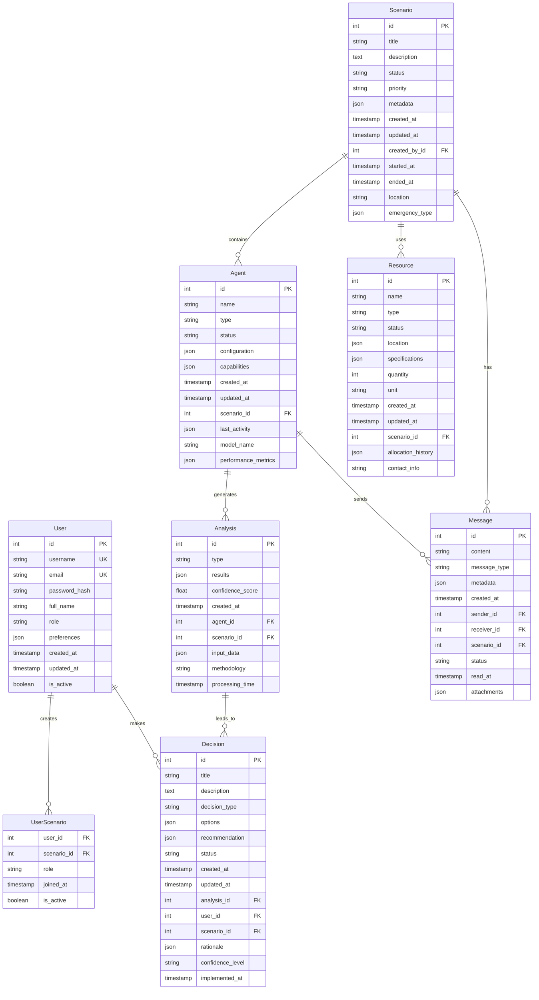

# 数据库ER图设计

## 概述

SAFE-BMAD系统的数据库设计基于S-A-F-E-R框架，支持多智能体协作、应急场景管理和决策分析。

## 核心实体关系图

## 实体详细说明

### 1. User (用户表)
系统用户信息，支持多种角色权限管理。

**字段说明：**
- `id`: 主键
- `username`: 用户名，唯一
- `email`: 邮箱，唯一
- `password_hash`: 密码哈希
- `full_name`: 全名
- `role`: 角色 (admin, operator, analyst, viewer)
- `preferences`: 用户偏好设置 (JSON)
- `created_at/updated_at`: 时间戳
- `is_active`: 是否激活

### 2. Scenario (应急场景表)
应急事件的核心数据实体。

**字段说明：**
- `id`: 主键
- `title`: 场景标题
- `description`: 详细描述
- `status`: 状态 (active, resolved, pending, closed)
- `priority`: 优先级 (low, medium, high, critical)
- `metadata`: 元数据 (JSON格式)
- `created_by_id`: 创建者ID
- `started_at/ended_at`: 开始/结束时间
- `location`: 事发地点
- `emergency_type`: 应急类型分类

### 3. UserScenario (用户场景关联表)
多对多关系表，记录用户参与场景的角色。

### 4. Agent (智能体表)
S-A-F-E-R框架的多智能体实例。

**智能体类型：**
- `S`: Strategist (战略家)
- `A`: Awareness (态势感知)
- `F`: FieldExpert (领域专家)
- `E`: Executor (执行官)
- `R`: Reviewer (评审者)

**字段说明：**
- `type`: 智能体类型
- `status`: 状态 (idle, running, paused, error, completed)
- `configuration`: 配置参数
- `capabilities`: 能力描述
- `scenario_id`: 所属场景
- `model_name`: 使用的AI模型
- `performance_metrics`: 性能指标

### 5. Analysis (分析结果表)
智能体生成的分析结果数据。

**字段说明：**
- `type`: 分析类型 (situational, risk, resource, impact)
- `results`: 分析结果 (JSON格式)
- `confidence_score`: 置信度分数
- `input_data`: 输入数据
- `methodology`: 分析方法
- `processing_time`: 处理耗时

### 6. Decision (决策记录表)
决策过程和结果记录。

**字段说明：**
- `decision_type`: 决策类型 (strategic, tactical, operational)
- `options`: 决策选项
- `recommendation`: 推荐方案
- `rationale`: 决策理由
- `confidence_level`: 置信级别
- `implemented_at`: 执行时间

### 7. Resource (资源表)
应急资源管理信息。

**字段说明：**
- `type`: 资源类型 (personnel, equipment, facility, supply)
- `location`: 资源位置
- `specifications`: 技术规格
- `allocation_history`: 分配历史
- `contact_info`: 联系信息

### 8. Message (消息表)
智能体间通信记录。

**字段说明：**
- `message_type`: 消息类型 (query, response, notification, alert)
- `sender_id/receiver_id`: 发送者/接收者ID
- `status`: 状态 (sent, delivered, read, failed)
- `attachments`: 附件信息

## 索引策略

### 主要索引
1. **主键索引**: 所有表的id字段
2. **外键索引**: 所有外键字段
3. **唯一索引**: username, email等唯一字段

### 查询优化索引
1. **场景查询索引**:
   - `(status, priority, created_at)`
   - `(created_by_id, status)`

2. **智能体查询索引**:
   - `(scenario_id, type, status)`
   - `(status, updated_at)`

3. **分析结果索引**:
   - `(scenario_id, agent_id, created_at)`
   - `(type, confidence_score)`

4. **决策记录索引**:
   - `(scenario_id, status, created_at)`
   - `(user_id, decision_type)`

5. **消息查询索引**:
   - `(scenario_id, created_at)`
   - `(sender_id, receiver_id, status)`

## 约束设计

### 外键约束
- 用户场景关联的级联删除
- 场景删除时相关数据的处理策略

### 数据完整性约束
- 枚举值约束 (status, priority, type等)
- 时间范围约束
- 数值范围约束 (confidence_score: 0-1)

## 性能优化策略

### 分区策略
- 按时间分区大表 (Message, Analysis logs)
- 按状态分区场景数据

### 缓存策略
- 热点场景数据缓存
- 用户会话信息缓存
- 智能体状态缓存

## 数据迁移版本控制

使用Alembic进行版本化管理：
- `001_initial_schema.py`: 创建基础表结构
- `002_add_indexes.py`: 创建索引
- `003_add_constraints.py`: 添加约束
- `004_add_audit_fields.py`: 添加审计字段

## 扩展性考虑

### 水平扩展
- 支持按场景分片
- 支持读写分离

### 垂直扩展
- 支持JSON字段的动态扩展
- 支持新实体类型的添加