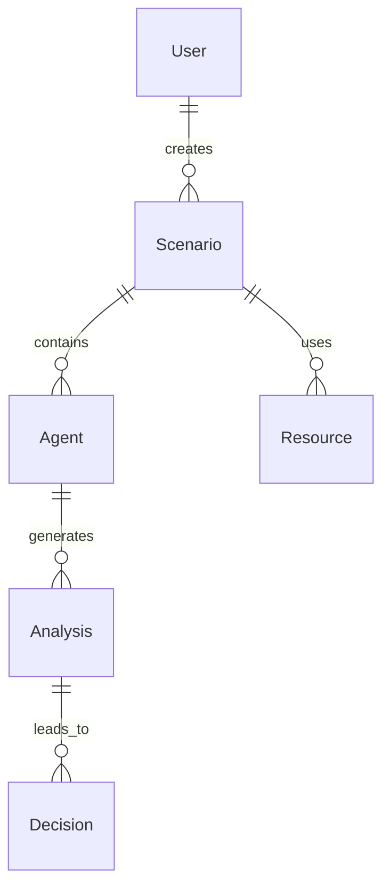

# Story 1.3: 数据库设计和基础API框架

## Status
Draft

## Story

**As a** 后端开发工程师,
**I want** 拥有完整的数据库设计和API框架,
**so that** 开始业务逻辑开发。

## Acceptance Criteria

1. 完成ER图设计，包含用户、场景、Agent、分析结果等核心实体
2. 创建数据库迁移脚本，支持版本化管理
3. FastAPI项目初始化，包含基础路由结构
4. SQLAlchemy ORM模型定义，支持基础CRUD操作
5. API文档自动生成(Swagger/OpenAPI)

## Tasks / Subtasks

- [ ] 设计数据库ER图和核心实体 (AC: #1)
  - [ ] 分析SAFE系统核心业务实体
    - [ ] 用户实体(User) - 系统用户信息
    - [ ] 应急场景实体(Scenario) - 应急事件数据
    - [ ] Agent状态实体(Agent) - 智能体状态信息
    - [ ] 分析结果实体(Analysis) - 分析结果数据
    - [ ] 决策记录实体(Decision) - 决策过程记录
    - [ ] 资源实体(Resource) - 救援资源信息
  - [ ] 设计实体关系和约束
    - [ ] 用户与场景的关系(多对多)
    - [ ] 场景与Agent的关系(一对多)
    - [ ] Agent与分析结果的关系(一对多)
    - [ ] 分析结果与决策的关系(一对多)
  - [ ] 创建ER图文档
    - [ ] 使用Mermaid语法绘制ER图
    - [ ] 保存到docs/database/er-diagram.md
    - [ ] 包含实体属性和关系说明
  - [ ] 设计数据库索引策略
    - [ ] 主键索引设计
    - [ ] 外键索引设计
    - [ ] 查询性能索引设计
    - [ ] 唯一性约束设计

- [ ] 创建数据库迁移系统 (AC: #2)
  - [ ] 选择迁移管理工具
    - [ ] Alembic - SQLAlchemy官方迁移工具
    - [ ] 配置Alembic环境
    - [ ] 创建迁移配置文件
  - [ ] 创建初始迁移脚本
    - [ ] 001_initial_schema.py - 创建所有表结构
    - [ ] 002_add_indexes.py - 创建索引
    - [   003_add_constraints.py - 添加约束
  - [ ] 建立迁移工作流程
    - [ ] migrate.sh - 数据库迁移脚本
    - [ ] rollback.sh - 回滚脚本
    - [ ] reset-db.sh - 重置数据库脚本
  - [ ] 配置迁移环境管理
    - [ ] 开发环境迁移配置
    - [ ] 测试环境迁移配置
    - [ ] 生产环境迁移配置
  - [ ] 创建迁移文档
    - [ ] docs/database/migrations.md - 迁移说明
    - [ ] 迁移最佳实践指南

- [ ] 初始化FastAPI项目 (AC: #3)
  - [ ] 创建FastAPI应用结构
    - [ ] main.py - 应用入口文件
    - [ ] app/ - 应用主目录
    - [   app/__init__.py - 应用初始化
    - [   app/core/ - 核心配置
    - [   app/api/ - API路由
    - [   app/db/ - 数据库相关
    - [   app/models/ - 数据模型
    - [   app/schemas/ - Pydantic模式
  - [ ] 配置FastAPI基础设置
    - [ ] 应用配置(config.py)
    - [ ] CORS配置
    - [ ] 中间件配置
    - [ ] 异常处理器配置
  - [ ] 创建基础路由结构
    - [   api/v1/ - API版本1路由
    - [   api/v1/__init__.py - 路由初始化
    - [   api/v1/endpoints/ - 端点定义
    - [   api/v1/api.py - 路由聚合
  - [ ] 配置依赖注入
    - [   dependencies/database.py - 数据库依赖
    - [   dependencies/security.py - 安全依赖
    - [   dependencies/common.py - 通用依赖
  - [ ] 创建应用启动脚本
    - [   run.py - 开发服务器启动
    - [   gunicorn.conf.py - 生产服务器配置

- [ ] 定义SQLAlchemy ORM模型 (AC: #4)
  - [ ] 创建基础模型类
    - [   models/base.py - 基础模型类
    - [   包含通用字段(id, created_at, updated_at)
    - [   包含通用方法(to_dict, from_dict等)
  - [ ] 实现核心实体模型
    - [   models/user.py - 用户模型
    - [   models/scenario.py - 场景模型
    - [   models/agent.py - Agent模型
    - [   models/analysis.py - 分析结果模型
    - [   models/decision.py - 决策记录模型
    - [   models/resource.py - 资源模型
  - [   实现关系模型
    - [   models/associations.py - 关联表模型
    - [   用户场景关联表
    - [   场景Agent关联表
    - [   其他多对多关系表
  - [ ] 实现CRUD基础操作
    - [   crud/base.py - 基础CRUD类
    - [   crud/user.py - 用户CRUD操作
    - [   crud/scenario.py - 场景CRUD操作
    - [   其他实体的CRUD操作
  - [   配置数据库会话管理
    - [   db/session.py - 数据库会话
    - [   db/database.py - 数据库连接
    - [   事务管理配置

- [ ] 实现基础API端点 (AC: #5)
  - [ ] 创建健康检查端点
    - [   GET /health - 基础健康检查
    - [   GET /ready - 就绪状态检查
    - [   GET /version - 版本信息
  - [   创建用户管理端点
    - [   POST /api/v1/users/ - 创建用户
    - [   GET /api/v1/users/ - 获取用户列表
    - [   GET /api/v1/users/{user_id} - 获取用户详情
    - [   PUT /api/v1/users/{user_id} - 更新用户
    - [   DELETE /api/v1/users/{user_id} - 删除用户
  - [   创建场景管理端点
    - [   POST /api/v1/scenarios/ - 创建场景
    - [   GET /api/v1/scenarios/ - 获取场景列表
    - [   GET /api/v1/scenarios/{scenario_id} - 获取场景详情
    - [   PUT /api/v1/scenarios/{scenario_id} - 更新场景
  - [   创建Agent状态端点
    - [   GET /api/v1/agents/ - 获取Agent状态列表
    - [   GET /api/v1/agents/{agent_type} - 获取特定Agent状态
    - [   PUT /api/v1/agents/{agent_type} - 更新Agent状态
  - [   实现分页和过滤
    - [   通用分页参数处理
    - [   查询过滤器实现
    - [   排序功能实现

- [ ] 配置API文档自动生成 (AC: #5)
  - [ ] 配置Swagger UI
    - [   启用OpenAPI文档生成
    - [   配置文档元信息
    - [   自定义文档样式
  - [   创建API文档
    - [   端点描述和示例
    - [   请求/响应模式定义
    - [   错误响应文档
  - [   配置ReDoc文档
    - [   备选文档界面
    - [   文档主题定制
  - [   创建API使用指南
    - [   docs/api/quick-start.md - 快速开始
    - [   docs/api/authentication.md - 认证指南
    - [   docs/api/examples.md - 使用示例

## 开发技术指引

### 核心技术栈
- ORM: SQLAlchemy 2.0+ (支持异步操作)
- API框架: FastAPI 0.104+ (高性能异步框架)
- 数据库: PostgreSQL 14+ (主数据库)
- 迁移工具: Alembic (SQLAlchemy官方工具)
- 文档: OpenAPI 3.0 + Swagger UI + ReDoc

### 关键数据接口
```python
# 核心数据库模型接口
from sqlalchemy import Column, Integer, String, DateTime, Boolean, JSON, Float
from sqlalchemy.ext.declarative import declarative_base
from sqlalchemy.sql import func

Base = declarative_base()

class AgentStatus(Base):
    """Agent状态数据模型"""
    __tablename__ = "agents"

    id = Column(Integer, primary_key=True, index=True)
    agent_type = Column(String(20), unique=True, nullable=False)  # 's', 'a', 'f', 'e', 'r'
    status = Column(String(20), nullable=False)  # 'running', 'stopped', 'error', 'idle'
    configuration = Column(JSON)
    last_updated = Column(DateTime(timezone=True), server_default=func.now())
    metadata = Column(JSON)

class AnalysisResult(Base):
    """分析结果数据模型"""
    __tablename__ = "analysis_results"

    id = Column(Integer, primary_key=True, index=True)
    scenario_id = Column(Integer, ForeignKey("scenarios.id"))
    agent_id = Column(Integer, ForeignKey("agents.id"))
    analysis_type = Column(String(50))
    results = Column(JSON)
    confidence_score = Column(Float)
    created_at = Column(DateTime(timezone=True), server_default=func.now())
```

### ER图概览


### 开发注意事项
- 使用SQLAlchemy 2.0异步模式提升性能
- 数据库设计支持AutoGen多智能体协作
- API设计遵循RESTful规范，支持Vue3前端
- 所有配置信息通过环境变量管理
- 数据库迁移版本化管理，支持回滚

### 性能要求
- API响应时间 < 100ms (健康检查)
- 数据库连接成功率 > 99%
- 支持并发连接数 >= 100
- 数据库查询优化，合理使用索引

### API设计原则
- RESTful API设计，资源导向
- 统一的错误响应格式
- API版本化管理 (v1, v2)
- 完整的Swagger文档
- 支持分页、过滤、排序

### 测试策略
- 单元测试: pytest + pytest-asyncio
- 集成测试: API端点完整测试
- 数据库测试: 迁移脚本和CRUD操作
- 性能测试: 并发连接和响应时间

### 依赖关系
- 依赖Story 1.1完成的项目结构
- 依赖Story 1.2完成的开发环境
- 为AutoGen多智能体框架提供数据基础
- 支持Vue3前端的实时数据需求

## Change Log

| Date | Version | Description | Author |
|------|---------|-------------|---------|
| 2025-10-20 | 1.0 | 初始故事创建 | John (PM) |

## Dev Agent Record

### Agent Model Used
(待开发时填写)

### Debug Log References
(待开发时填写)

### Completion Notes List
(待开发时填写)

### File List
(待开发时填写)

## QA Results
(待QA测试时填写)